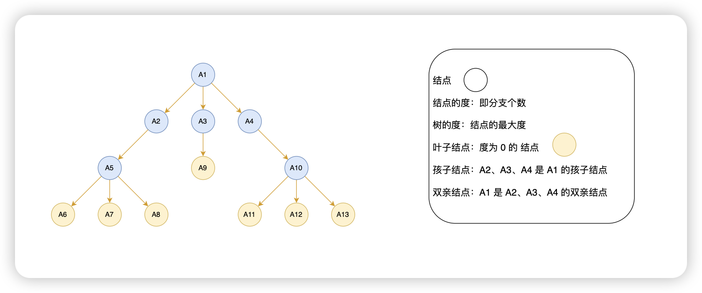
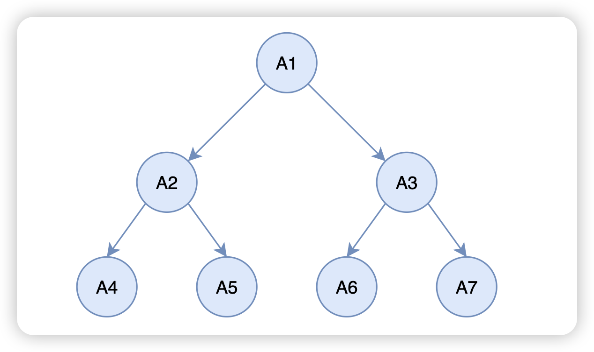
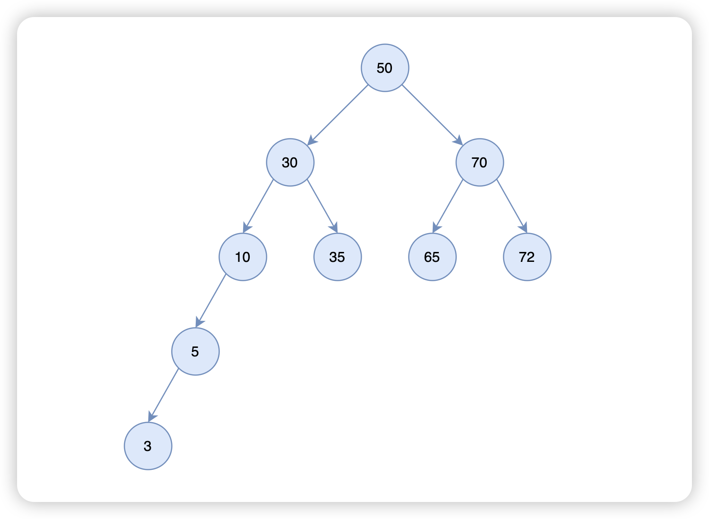
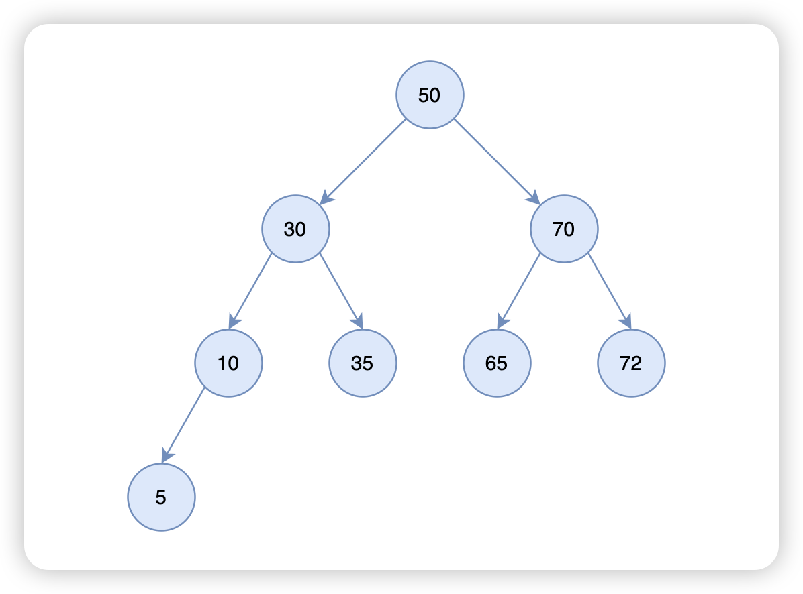
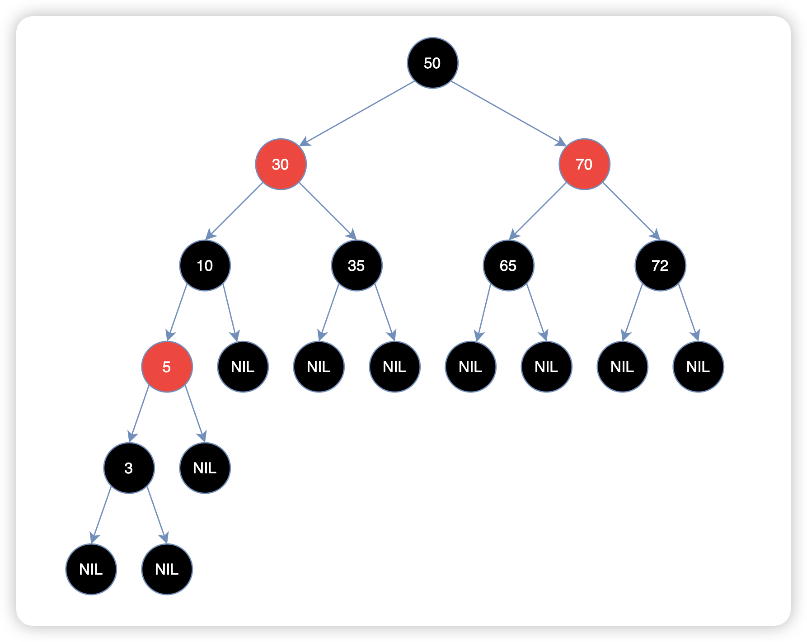
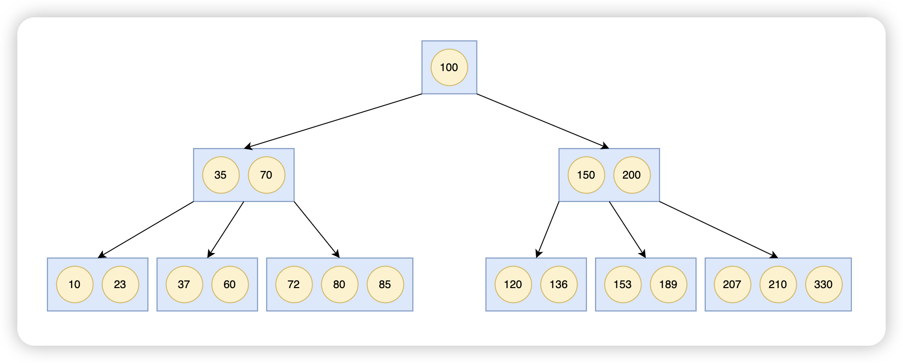
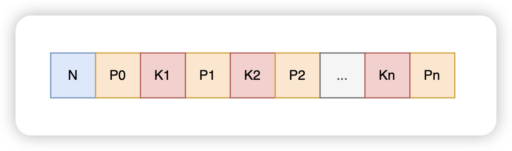
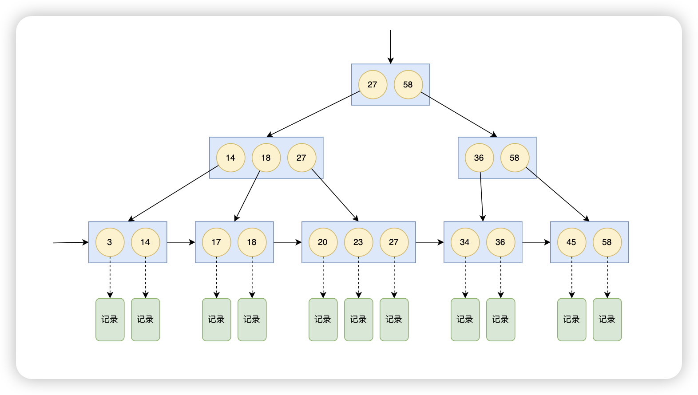

# 树的基本概念

# 二叉树

- 结点的度最大为 2。
- 子树有左右之分。

# 二叉搜索树

- 结点的度最大为 2。
- 子树有左右之分。
- 任一结点的值大于其左子树中任意一个结点的值，小于其右子树中任意一结点的值。

# 平衡二叉搜索树

- 结点的度最大为 2。
- 子树有左右之分。
- 任一结点的值大于其左子树中任意一个结点的值，小于其右子树中任意一结点的值。
- 任一结点的子树的高度差最大为 1。

# 红黑树

- 结点是红色或黑色。
- 根是黑色。
- 所有叶子都是黑色（叶子是NIL结点）。
- 每个红色结点必须有两个黑色的子结点。（或者说从每个叶子到根的所有路径上不能有两个连续的红色结点。）（或者说不存在两个相邻的红色结点，相邻指两个结点是父子关系。）（或者说红色结点的父结点和子结点均是黑色的。）
- 从任一结点到其每个叶子的所有简单路径都包含相同数目的黑色结点。

> **平衡二叉搜索树（AVL）**比**红黑树**更加平衡，但**平衡二叉搜索树（AVL）**可能在插入和删除过程中引起更多旋转
>
> **红黑树**优先保证调整效率，适合动态操作。
>
> **平衡二叉搜索树（AVL）**优先保证搜索效率，适合读多写少的场景。

# B 树

- B树是一种自平衡搜索树，设计的主要思想是减少磁盘访问次数。
- 在 B 树中，有两种结点：
  - 内部结点（internal node）：存储了数据以及指向其子结点的指针。
  - 叶子结点（leaf node）：与内部结点不同的是，叶子结点只存储数据，并没有子结点。
- 一棵 M 阶的 B 树的特性。表示这个树的每一个结点最多可以拥有的子结点个数。一棵 M 阶的 B 树满足的性质如下：
  - 每个结点最多有 M 个子结点。最少有 M/2 个子结点（除根结点外）。
  - 每个结点最多有 M - 1 个内部结点。
  - 每一个非叶子结点（除根结点）最少有 M 个子结点。
  - 内部结点按递增顺序排列，用于分隔子树范围。
  - 所有的叶子结点都在同一层。

M = 4 的 B 树，如图所示：

结点数据：

- N：有 N 个内部结点。
- P0：表示指向第 0 个子结点的指针，p1 表示指向第 1 个子结点的指针，以此类推。
- K1：表示第一个内部结点，K2 表示第二个内部结点，以此类推。

# B+ 树

- 继承 B 树大部分的特性。
- 非叶子结点不保存记录，仅作为索引。
- 叶子结点之间有单向指针，方便遍历。
- 叶子结点有指向记录的指针。
- 一个内部结点对应一个分支。

**B树 vs B+树**

| 特性         | B树                                | B+树                               |
| ------------ | ---------------------------------- | ---------------------------------- |
| 数据存储位置 | 非叶子结点和叶子结点均可存储       | 数据仅存储在叶子结点               |
| 范围查询效率 | 较低                               | 高效，叶子结点链表支持顺序遍历     |
| 查询路径长度 | 可能在非叶子结点找到数据，路径较短 | 所有数据在叶子结点，路径固定较长   |
| 空间利用率   | 较低                               | 较高                               |
| 应用场景     | 一般查询和更新场景                 | 数据库索引、大文件系统范围查询场景 |

# 参考资料

- https://zh.wikipedia.org/wiki/%E7%BA%A2%E9%BB%91%E6%A0%91
- https://cloud.tencent.com/developer/article/1669288
- https://www.bilibili.com/video/BV1bs421u7pY/?spm_id_from=333.337.search-card.all.click&vd_source=36c9c5090433526ff4f5acf2f85909d4