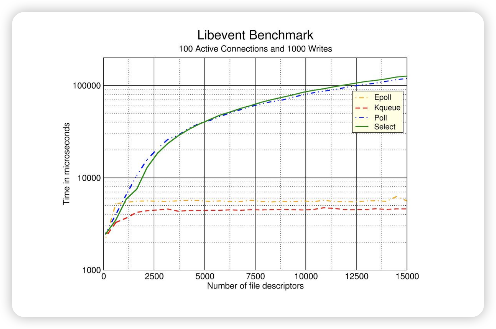

# 为什么是 epoll

- select

  ```c
  // 返回：若有就绪描述符则为其数目，若超时则为0，若出错则为-1
  int select(int nfds, fd_set *readfds, fd_set *writefds, fd_set *exceptfds, struct timeval *timeout);
  ```

  - 通过 select 告诉内核，我们对哪些 socket 的哪些事件感兴趣
    - 将 socket 文件描述符数组用用户态复制到内核态，内核去遍历每一个 socket，当有事件发生时，将 socket 标记为可读/写，然后再把整个集合复制到用户态，用户态再次遍历查找可读/写的 socket，进行下一步处理
    - select 函数对每一个描述符集合fd_set，最多可以同时监听1024个描述符

- poll

  ```c
  // 返回：若有就绪描述符则为其数目，若超时则为0，若出错则为-1
  int poll(struct pollfd *fds, nfds_t nfds, int timeout);
  ```

  - 与 select 类似，没有 1024 的限制

## Benchmark



# epoll

```c
int main() {
  int sockfd = socket(AF_INET, SOCK_STREAM|SOCK_NONBLOCK, 0);
  int epfd = epoll_create(MAXEPOLLSIZE);
  epoll_ctl(epfd, EPOLL_CTL_ADD, sockfd, &event);
  int nfds = epoll_wait(kdpfd, events, curfds, -1);
}
```

## epoll_create

1. `epoll_create` 创建一个  `struct eventpoll` 实例，管理 `epoll` 的状态和事件，并返回一个文件描述符，通过该文件对象连接到用户态。
2. `eventpoll` 主要字段及其功能：

| 字段名    | 类型               | 功能                                                         |
| --------- | ------------------ | ------------------------------------------------------------ |
| rbr       | struct rb_root     | 红黑树，用户存储注册的文件描述符和事件。（epoll_ctl调用后，socket 会添加到该树上） |
| rdllist   | struct list_head   | 就绪队列，双向链表，存储已触发的事件供用户检索。             |
| wq        | wait_queue_head_t  | 等待队列，用户挂起调用`epoll_wait`的用户进程。（为什么是队列而不是当前进程：1、多个线程可能同时对同一个 `epoll` 实例调用 `epoll_wait()`。2、如果通过 `fork()` 创建了子进程，父子进程可以共享同一个 `epoll` 实例，并同时调用 `epoll_wait()`。） |
| poll_wait | wait_queue_head_t  | 等待队列，用于监听文件描述符状体变化。用来处理递归监听的情况。 |
| ovflist   | struct epitem *    | 溢出列表，存储触发但无法立即处理的事件。                     |
| lock      | spinlock_t         | 自旋锁，保护共享数据在多线程环境下的一致性。                 |
| file      | struct file *      | 表示与`epoll`实例关联的文件对象。                            |
| user      | struct poll_user * | 记录创建该实例的用户，限制单用户创建的`epoll`实例数量。      |

## epoll_ctl

1. 将 socket 封装成 epitem 添加到 eventpoll 对象中的红黑树
2. 设置 socket 就绪后的回调函数为 ep_poll_callback

## epoll_wait

1. 检查 eventpoll 就绪队列，存在就绪队列则处理数据
2. 就绪队列为空则挂起当前进程，让出 cpu，等待会唤醒

# 流程解析



##  流程一、构建 eventpoll，添加 socket，调用 epoll_wait 过程

### 创建 eventpoll

```c
/*
 * Open an eventpoll file descriptor.
 */
static int do_epoll_create(int flags)
{
	int error, fd;
	struct eventpoll *ep = NULL;
	struct file *file;
  ...
	/*
	 * Create the internal data structure ("struct eventpoll").
	 */
	error = ep_alloc(&ep);
	if (error < 0)
		return error;
	...
	file = anon_inode_getfile("[eventpoll]", &eventpoll_fops, ep,
				 O_RDWR | (flags & O_CLOEXEC));
	if (IS_ERR(file)) {
		error = PTR_ERR(file);
		goto out_free_fd;
	}
	ep->file = file;
	fd_install(fd, file);
	return fd;
}
```

#### 初始化 eventpoll

```c
static int ep_alloc(struct eventpoll **pep)
{
	struct eventpoll *ep;

	ep = kzalloc(sizeof(*ep), GFP_KERNEL);
	if (unlikely(!ep))
		return -ENOMEM;

	mutex_init(&ep->mtx);
	rwlock_init(&ep->lock);
	init_waitqueue_head(&ep->wq);
	init_waitqueue_head(&ep->poll_wait);
	INIT_LIST_HEAD(&ep->rdllist);
	ep->rbr = RB_ROOT_CACHED;
	ep->ovflist = EP_UNACTIVE_PTR;
	ep->user = get_current_user();
	refcount_set(&ep->refcount, 1);

	*pep = ep;

	return 0;
}

```

### 添加 socket

```c
int do_epoll_ctl(int epfd, int op, int fd, struct epoll_event *epds,
		 bool nonblock)
{
	int error;
	int full_check = 0;
	struct eventpoll *ep;
	struct epitem *epi;
	struct eventpoll *tep = NULL;
	...
	/*
	 * Try to lookup the file inside our RB tree. Since we grabbed "mtx"
	 * above, we can be sure to be able to use the item looked up by
	 * ep_find() till we release the mutex.
	 */
	epi = ep_find(ep, fd_file(tf), fd);

	error = -EINVAL;
	switch (op) {
	case EPOLL_CTL_ADD:
		if (!epi) {
			epds->events |= EPOLLERR | EPOLLHUP;
			error = ep_insert(ep, epds, fd_file(tf), fd, full_check);
		} else
			error = -EEXIST;
		break;
	case EPOLL_CTL_DEL:
	...
}
```

#### 插入到红黑树

```c
/*
 * Must be called with "mtx" held.
 */
static int ep_insert(struct eventpoll *ep, const struct epoll_event *event,
		     struct file *tfile, int fd, int full_check)
{
	int error, pwake = 0;
	__poll_t revents;
	struct epitem *epi;
	struct ep_pqueue epq;
	struct eventpoll *tep = NULL;

	...
	/*
	 * Add the current item to the RB tree. All RB tree operations are
	 * protected by "mtx", and ep_insert() is called with "mtx" held.
	 */
	ep_rbtree_insert(ep, epi);
	if (tep)
		mutex_unlock(&tep->mtx);

	/* Initialize the poll table using the queue callback */
	epq.epi = epi;
	init_poll_funcptr(&epq.pt, ep_ptable_queue_proc);
	...
}
```

#### 设置回调函数 

```c
/*
 * This is the callback that is used to add our wait queue to the
 * target file wakeup lists.
 */
static void ep_ptable_queue_proc(struct file *file, wait_queue_head_t *whead,
				 poll_table *pt)
{
	struct ep_pqueue *epq = container_of(pt, struct ep_pqueue, pt);
	struct epitem *epi = epq->epi;
	struct eppoll_entry *pwq;

	if (unlikely(!epi))	// an earlier allocation has failed
		return;

	pwq = kmem_cache_alloc(pwq_cache, GFP_KERNEL);
	if (unlikely(!pwq)) {
		epq->epi = NULL;
		return;
	}

	init_waitqueue_func_entry(&pwq->wait, ep_poll_callback);
	pwq->whead = whead;
	pwq->base = epi;
	if (epi->event.events & EPOLLEXCLUSIVE)
		add_wait_queue_exclusive(whead, &pwq->wait);
	else
		add_wait_queue(whead, &pwq->wait);
	pwq->next = epi->pwqlist;
	epi->pwqlist = pwq;
}
```

### 调用 epoll_wait

```c
/*
 * Implement the event wait interface for the eventpoll file. It is the kernel
 * part of the user space epoll_wait(2).
 */
static int do_epoll_wait(int epfd, struct epoll_event __user *events,
			 int maxevents, struct timespec64 *to)
{
	struct eventpoll *ep;

	/* The maximum number of event must be greater than zero */
	if (maxevents <= 0 || maxevents > EP_MAX_EVENTS)
		return -EINVAL;

	/* Verify that the area passed by the user is writeable */
	if (!access_ok(events, maxevents * sizeof(struct epoll_event)))
		return -EFAULT;

	/* Get the "struct file *" for the eventpoll file */
	CLASS(fd, f)(epfd);
	if (fd_empty(f))
		return -EBADF;

	/*
	 * We have to check that the file structure underneath the fd
	 * the user passed to us _is_ an eventpoll file.
	 */
	if (!is_file_epoll(fd_file(f)))
		return -EINVAL;

	/*
	 * At this point it is safe to assume that the "private_data" contains
	 * our own data structure.
	 */
	ep = fd_file(f)->private_data;

	/* Time to fish for events ... */
	return ep_poll(ep, events, maxevents, to);
}
```

#### 循环处理事件

```c
/**
 * ep_poll - Retrieves ready events, and delivers them to the caller-supplied
 *           event buffer.
 *
 * @ep: Pointer to the eventpoll context.
 * @events: Pointer to the userspace buffer where the ready events should be
 *          stored.
 * @maxevents: Size (in terms of number of events) of the caller event buffer.
 * @timeout: Maximum timeout for the ready events fetch operation, in
 *           timespec. If the timeout is zero, the function will not block,
 *           while if the @timeout ptr is NULL, the function will block
 *           until at least one event has been retrieved (or an error
 *           occurred).
 *
 * Return: the number of ready events which have been fetched, or an
 *          error code, in case of error.
 */
static int ep_poll(struct eventpoll *ep, struct epoll_event __user *events,
		   int maxevents, struct timespec64 *timeout)
{
	int res, eavail, timed_out = 0;
	u64 slack = 0;
	wait_queue_entry_t wait;
	ktime_t expires, *to = NULL;

	lockdep_assert_irqs_enabled();

	if (timeout && (timeout->tv_sec | timeout->tv_nsec)) {
		slack = select_estimate_accuracy(timeout);
		to = &expires;
		*to = timespec64_to_ktime(*timeout);
	} else if (timeout) {
		/*
		 * Avoid the unnecessary trip to the wait queue loop, if the
		 * caller specified a non blocking operation.
		 */
		timed_out = 1;
	}

	/*
	 * This call is racy: We may or may not see events that are being added
	 * to the ready list under the lock (e.g., in IRQ callbacks). For cases
	 * with a non-zero timeout, this thread will check the ready list under
	 * lock and will add to the wait queue.  For cases with a zero
	 * timeout, the user by definition should not care and will have to
	 * recheck again.
	 */
	eavail = ep_events_available(ep);

	while (1) {
		if (eavail) {
			/*
			 * Try to transfer events to user space. In case we get
			 * 0 events and there's still timeout left over, we go
			 * trying again in search of more luck.
			 */
			res = ep_send_events(ep, events, maxevents);
			if (res) {
				if (res > 0)
					ep_suspend_napi_irqs(ep);
				return res;
			}
		}

		if (timed_out)
			return 0;

		eavail = ep_busy_loop(ep, timed_out);
		if (eavail)
			continue;

		if (signal_pending(current))
			return -EINTR;

		/*
		 * Internally init_wait() uses autoremove_wake_function(),
		 * thus wait entry is removed from the wait queue on each
		 * wakeup. Why it is important? In case of several waiters
		 * each new wakeup will hit the next waiter, giving it the
		 * chance to harvest new event. Otherwise wakeup can be
		 * lost. This is also good performance-wise, because on
		 * normal wakeup path no need to call __remove_wait_queue()
		 * explicitly, thus ep->lock is not taken, which halts the
		 * event delivery.
		 *
		 * In fact, we now use an even more aggressive function that
		 * unconditionally removes, because we don't reuse the wait
		 * entry between loop iterations. This lets us also avoid the
		 * performance issue if a process is killed, causing all of its
		 * threads to wake up without being removed normally.
		 */
		init_wait(&wait);
		wait.func = ep_autoremove_wake_function;

		write_lock_irq(&ep->lock);
		/*
		 * Barrierless variant, waitqueue_active() is called under
		 * the same lock on wakeup ep_poll_callback() side, so it
		 * is safe to avoid an explicit barrier.
		 */
		__set_current_state(TASK_INTERRUPTIBLE);

		/*
		 * Do the final check under the lock. ep_start/done_scan()
		 * plays with two lists (->rdllist and ->ovflist) and there
		 * is always a race when both lists are empty for short
		 * period of time although events are pending, so lock is
		 * important.
		 */
		eavail = ep_events_available(ep);
		if (!eavail)
			__add_wait_queue_exclusive(&ep->wq, &wait);

		write_unlock_irq(&ep->lock);

		if (!eavail)
			timed_out = !schedule_hrtimeout_range(to, slack,
							      HRTIMER_MODE_ABS);
		__set_current_state(TASK_RUNNING);

		/*
		 * We were woken up, thus go and try to harvest some events.
		 * If timed out and still on the wait queue, recheck eavail
		 * carefully under lock, below.
		 */
		eavail = 1;

		if (!list_empty_careful(&wait.entry)) {
			write_lock_irq(&ep->lock);
			/*
			 * If the thread timed out and is not on the wait queue,
			 * it means that the thread was woken up after its
			 * timeout expired before it could reacquire the lock.
			 * Thus, when wait.entry is empty, it needs to harvest
			 * events.
			 */
			if (timed_out)
				eavail = list_empty(&wait.entry);
			__remove_wait_queue(&ep->wq, &wait);
			write_unlock_irq(&ep->lock);
		}
	}
}
```

#### 设置 epoll 回调函数

```c
/*
 * autoremove_wake_function, but remove even on failure to wake up, because we
 * know that default_wake_function/ttwu will only fail if the thread is already
 * woken, and in that case the ep_poll loop will remove the entry anyways, not
 * try to reuse it.
 */
static int ep_autoremove_wake_function(struct wait_queue_entry *wq_entry,
				       unsigned int mode, int sync, void *key)
{
	int ret = default_wake_function(wq_entry, mode, sync, key);

	/*
	 * Pairs with list_empty_careful in ep_poll, and ensures future loop
	 * iterations see the cause of this wakeup.
	 */
	list_del_init_careful(&wq_entry->entry);
	return ret;
}
```


## 流程二、数据包到达时

1. 数据包到达网卡
2. 网卡将数据包 DMA 到内核中的 Ring Buffer
3. 网卡向 CPU 发出硬中断
4. CPU 简单处理硬中断
5. ksofirqd 进程处理软中断，调用网卡注册的 poll 函数开始收包
6. 数据包从 Ring Buffer 上取出来，保存为一个 skb
7. 协议层接管 skb，并将 data 部分放到 socket 接收队列
8. 触发 socket 上注册的 ep_poll_callback 函数
9. ep_poll_callback 触发 eventpoll 上注册的 default_wake_function 函数
10. default_wake_function 唤醒用户进程
11. 用户进程则开始循环检测就绪队列，如果存在数据则交由用户进程处理，如果不存在则挂起当前进程，让出 CPU，等待下次被唤醒。