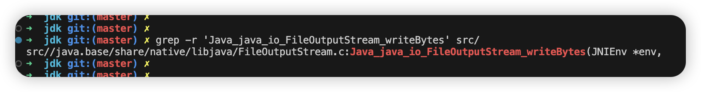
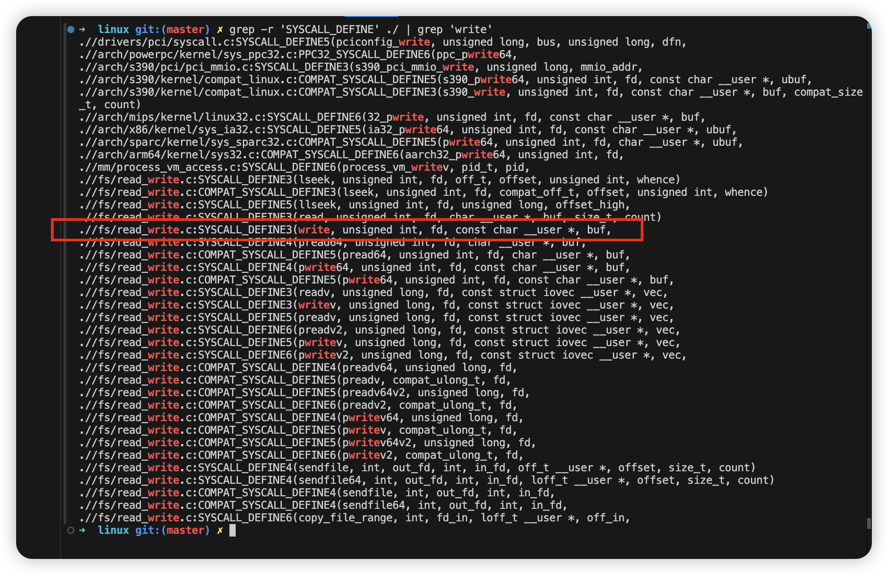
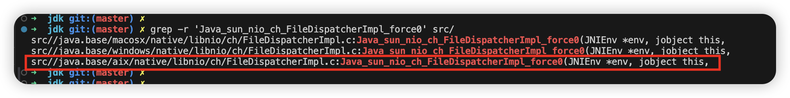
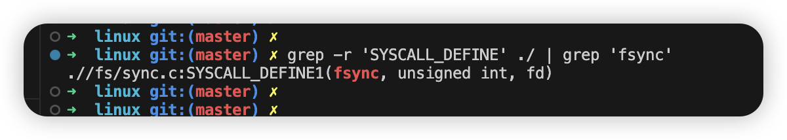

# 从 Demo 入手

```java
import java.io.File;
import java.io.FileOutputStream;
import java.io.IOException;

public class Main {

    public static void main(String[] args) throws IOException {
        String filePath = "./demo.txt";
        String content = "Can this content be persisted to disk?";
        File file = new File(filePath);
        try (FileOutputStream fos = new FileOutputStream(file)) {
            fos.write(content.getBytes());
            fos.flush();
        }
    }
}
```

先思考一下，你认为这段代码能正确的把数据写入磁盘吗？

在笔者模糊的认知里，认为这段代码是可靠的。直到最近项目在测试阶段（掉电测试）出现一个奇怪的事情。有一个 java 进程，将配置信息写入文件后，向 M 服务发起一个远程调用。M 服务有收到请求，但是内容却没被写入文件。

## 分析 java 代码：

先看 `fos.flush();`

```java
// OutputStream.java
public void flush() throws IOException {
}
```

竟然是空实现！！！

在看 `fos.write(content.getBytes());`

```java
public void write(byte b[]) throws IOException {
    writeBytes(b, 0, b.length, fdAccess.getAppend(fd));
}
```

```java
private native void writeBytes(byte b[], int off, int len, boolean append) throws IOException;
```

可以看到调用了一个 native 方法，接着来看 `writeBytes`。

> 小技巧
>
> > `writeBytes` 的 Reference 为 java.io.FileOutputStream#writeBytes
> >
> > 我们将 ”.“ 和 ”#“ 替换成 "下划线"，并在最前面拼接 "Java_" 我们就可以得到 `Java_java_io_FileOutputStream_writeBytes`

## 进入 jdk 源码：

```shell
grep -r 'Java_java_io_FileOutputStream_writeBytes' src/
```



接着打开 `FileOutputStream.c`

```c
JNIEXPORT void JNICALL
Java_java_io_FileOutputStream_writeBytes(JNIEnv *env,
    jobject this, jbyteArray bytes, jint off, jint len, jboolean append) {
    writeBytes(env, this, bytes, off, len, append, fos_fd);
}
```

继续看`writeBytes`

```c
void writeBytes(JNIEnv *env, jobject this, jbyteArray bytes, jint off, jint len, jboolean append, jfieldID fid)
{
    jint n;
    char stackBuf[BUF_SIZE];
    char *buf = NULL;
    FD fd;

    if (append == JNI_TRUE) {
        n = IO_Append(fd, buf+off, len);
    } else {
        n = IO_Write(fd, buf+off, len);
    }       
}
```

继续看 `IO_Write`

```c
#define IO_Write handleWrite
```

```c
ssize_t handleWrite(FD fd, const void *buf, jint len)
{
    ssize_t result;
    RESTARTABLE(write(fd, buf, len), result);
    return result;
}
```

```c
ssize_t	 write(int __fd, const void * __buf, size_t __nbyte) __DARWIN_ALIAS_C(write);
```

可以看到最终发起了一个 write 的系统调用！！

## 进入 linux 源码

```c
grep -r 'SYSCALL_DEFINE' ./ | grep 'write'
```



`.//fs/read_write.c:SYSCALL_DEFINE3(write, unsigned int, fd, const char __user *, buf,`

这行就是我们要定位的入口。

```c
SYSCALL_DEFINE3(write, unsigned int, fd, const char __user *, buf, size_t, count)
{
	return ksys_write(fd, buf, count);
}
```

```c
ssize_t ksys_write(unsigned int fd, const char __user *buf, size_t count)
{
	CLASS(fd_pos, f)(fd);
	ssize_t ret = -EBADF;

	if (!fd_empty(f)) {
		loff_t pos, *ppos = file_ppos(fd_file(f));
		if (ppos) {
			pos = *ppos;
			ppos = &pos;
		}
		ret = vfs_write(fd_file(f), buf, count, ppos);
		if (ret >= 0 && ppos)
			fd_file(f)->f_pos = pos;
	}

	return ret;
}
```

### vfs_write

- `vfs_write` 会根据文件的类型（例如普通文件、块设备等），通过相应的文件系统接口进一步处理数据。例如，`vfs_write` 会调用文件系统实现的 `write` 函数来执行具体的文件写入。

- 数据通常不会立即写入磁盘，而是先写入内存中的缓存（page cache）。内核会把写入的数据缓存在内存中，以提高写入性能。

- 数据写入内存后，会通过定时刷盘操作（如周期性刷新或者在文件关闭时）或通过调用 `fsync` 等系统调用，将内存中的数据最终写入磁盘。

### 查看相关内核参数

```shell
sysctl -a | grep dirty
```

Output:

```shell
vm.dirty_background_bytes = 0
vm.dirty_background_ratio = 10
vm.dirty_bytes = 0
vm.dirty_expire_centisecs = 3000
vm.dirty_ratio = 30
vm.dirty_writeback_centisecs = 500
```

- `vm.dirty_background_bytes = 0`：表示当脏页面的总字节数达到此值时内核会开始将脏页面写回磁盘，0 表示不限制。过程是低优先级的，不会影响其他任务的执行
- `vm.dirty_background_ratio = 10`：当脏页面的大小占系统总内存的 10% 时内核会启动后台刷盘过程。过程是低优先级的，不会影响其他任务的执行。
- `vm.dirty_bytes = 0`：表示当脏页面的总字节数达到此值时内核会开始将脏页面写回磁盘，0 表示不限制。会阻塞所有新的 I/O 操作。
- `vm.dirty_ratio = 30`：当脏页面占用系统总内存的 30% 时内核会强制执行写回操作。会阻塞所有新的 I/O 操作。
- `vm.dirty_expire_centisecs = 3000`：表示脏页面如果在内存中存在超过 3000 毫秒（即 30 秒），即使没有达到阈值，也会被强制写入磁盘。
- `vm.dirty_writeback_centisecs = 500`：表示每 500 毫秒，内核会进行一次脏页面写回检查。


# java 该如何保证内容被正确的写入磁盘呢？

## 使用 `FileChannel`

```java
import java.io.IOException;
import java.io.RandomAccessFile;
import java.nio.ByteBuffer;
import java.nio.channels.FileChannel;

public class Main {

    public static void main(String[] args) throws IOException {
        String filePath = "./demo.txt";
        String content = "Can this content be persisted to disk?";
        try (RandomAccessFile writer = new RandomAccessFile(filePath, "rw"); 
             FileChannel channel = writer.getChannel()) {
            ByteBuffer buff = ByteBuffer.wrap(content.getBytes());
            channel.write(buff);
            channel.force(true);
        }
    }
}
```

## 关键代码 channel.force(true);

`channel.force(true)` 最终会调用一个 `native` 方法 `force0`

```java
static native int force0(FileDescriptor fd, boolean metaData) throws IOException;
```

## 进入 jdk 源码

```shell
grep -r 'Java_sun_nio_ch_FileDispatcherImpl_force0' src/
```



```c
JNIEXPORT jint JNICALL
Java_sun_nio_ch_FileDispatcherImpl_force0(JNIEnv *env, jobject this, jobject fdo, jboolean md)
{
    jint fd = fdval(env, fdo);
    int result = 0;

    if (md == JNI_FALSE) {
        result = fdatasync(fd);
    } else {
        /* Calling fsync on a file descriptor that is opened only for
         * reading results in an error ("EBADF: The FileDescriptor parameter is
         * not a valid file descriptor open for writing.").
         * However, at this point it is not possibly anymore to read the
         * 'writable' attribute of the corresponding file channel so we have to
         * use 'fcntl'.
         */
        int getfl = fcntl(fd, F_GETFL);
        if (getfl >= 0 && (getfl & O_ACCMODE) == O_RDONLY) {
            return 0;
        }
        result = fsync(fd);
    }

    return handle(env, result, "Force failed");
}
```

```c
int  fsync(int) __DARWIN_ALIAS_C(fsync);
```

可以看到发起了 `fsync` 的系统调用

## 进入 linux 源码

```shell
grep -r 'SYSCALL_DEFINE' ./ | grep 'fsync'
```



```c
SYSCALL_DEFINE1(fsync, unsigned int, fd)
{
	return do_fsync(fd, 0);
}
```

```c
static int do_fsync(unsigned int fd, int datasync)
{
	CLASS(fd, f)(fd);

	if (fd_empty(f))
		return -EBADF;

	return vfs_fsync(fd_file(f), datasync);
}
```

### vfs_fsync

```c
/**
 * vfs_fsync - perform a fsync or fdatasync on a file
 * @file:		file to sync
 * @datasync:		only perform a fdatasync operation
 *
 * Write back data and metadata for @file to disk.  If @datasync is
 * set only metadata needed to access modified file data is written.
 */
int vfs_fsync(struct file *file, int datasync)
{
	return vfs_fsync_range(file, 0, LLONG_MAX, datasync);
}
```

触发写盘！！

# 总结

- `vfs_write`：无法保证数据写入磁盘，`vfs_fsync`：可以保证数据写入磁盘。
- 使用 java 保存重要信息到文件时，优先考虑 `FileChannel`。

# 参考资料

- https://notes.eddyerburgh.me/operating-systems/linux/the-page-cache-and-page-writeback
- https://juejin.cn/post/7266456735593185316
- https://en.wikipedia.org/wiki/Page_cache