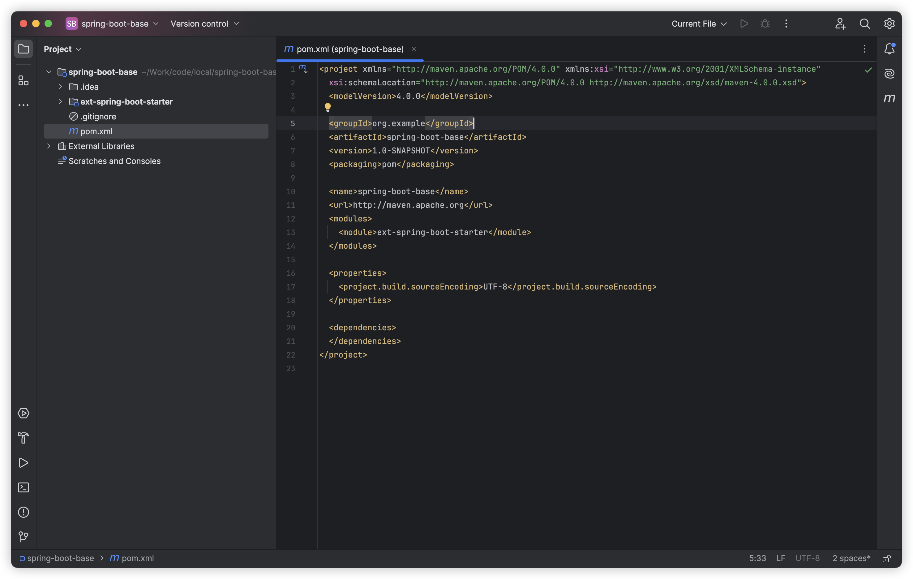
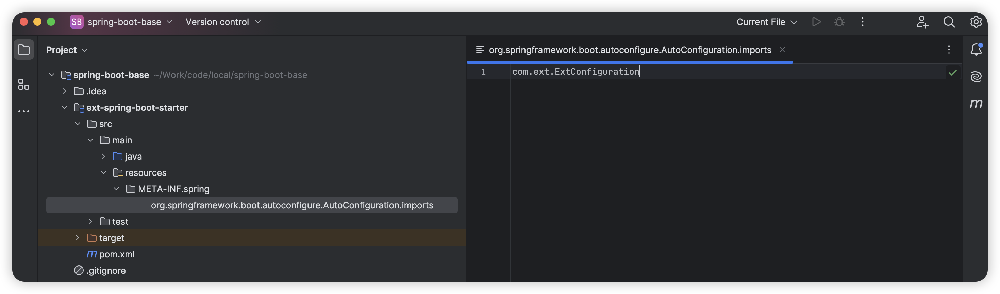
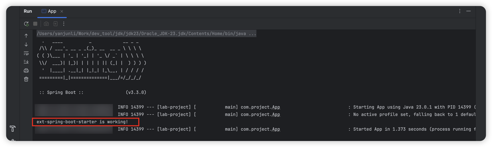

# spring boot starter 是什么？

> Spring Boot Starters are a set of convenient dependency descriptors that you can include in your application. You get a one-stop-shop for all the Spring and related technology that you need without having to hunt through sample code and copy paste loads of dependency descriptors. For example, if you want to get started using Spring and JPA for database access include the `spring-boot-starter-data-jpa` dependency in your project, and you are good to go.
>
> 摘自：https://github.com/spring-projects/spring-boot/blob/main/spring-boot-project/spring-boot-starters/README.adoc


# 如何自定义 spring boot starter？

在自定义 `spring boot starter` 之前，我们思考一个问题：我们该如何把自定义的 `starter` 里的 `bean` 加入到 `spring` 容器中呢？

答案就是：利用 `spring` 的 `SPI` 机制。

`SPI` 就像一个纽带一样把 `starter` 里的 `bean` 与 `spring` 容器连接起来。


## 封装规范

- 官方的 starter 包规范：spring-boot-starter-xxx
- 自定义 starter 包规范：xxx-spring-boot-starter


## 编写 starter

> spring boot 2.x 和 3.x 略有差异，我们使用 3.x

接下来开始定义我们的自己的 `spring boot starter`，命名 `ext-spring boot starter` 好了。

现在我们使用 idea 新建一个 `spring-boot-base` 的项目作为父项目，用来统一管理自定义的 `spring boot starter`。

然后新建一个 `module`，名字就是 `ext-spring-boot-starter`



接下来我们在  `ext-spring-boot-starter` 的 `pom` 文件下添加依赖

```xml
<dependency>
    <groupId>org.springframework.boot</groupId>
    <artifactId>spring-boot-autoconfigure</artifactId>
    <version>3.3.2</version>
</dependency>
```

然后我们在  `ext-spring-boot-starter` 的 java 目录下创建一个 `Listener`，并添加 `@Component` 注解。

```java
package com.ext;

import org.springframework.context.ApplicationListener;
import org.springframework.context.event.ContextRefreshedEvent;
import org.springframework.stereotype.Component;

@Component
public class ExtListener implements ApplicationListener<ContextRefreshedEvent> {

    @Override
    public void onApplicationEvent(ContextRefreshedEvent event) {
        System.out.println("ext-spring-boot-starter is working!");
    }
}
```

再来创建一个配置类，并添加 `@Configuration` 注解。

```java
package com.ext;

import org.springframework.context.annotation.Bean;
import org.springframework.context.annotation.Configuration;

@Configuration
public class ExtConfiguration {

	@Bean
	public ExtListener customListener() {
		return new ExtListener();
	}
}
```

现在我们可以通过 `ExtConfiguration` 把 `ExtListener` 联系起来了。那怎么把 `ExtConfiguration` 与 `spring` 容器联系起来呢？接下来重点来了!!

我们在  `ext-spring-boot-starter` 的 `resources` 目录下创建一个目录 `META-INF/spring`。再创建一个名为 `org.springframework.boot.autoconfigure.AutoConfiguration.imports` 的文件，内容就是 `ExtConfiguration` 的全路径。



让我们在根目录下执行 `mvn clean install` 将 jar 打到本地仓库。到目前为止，我们的代码算是写完了，是不是很简单。

## 测试 starter

新写一个 `springboot` 项目，在 `pom` 下添加我们自定义的 `starter`。

```xml
<dependency>
    <groupId>org.example</groupId>
    <artifactId>ext-spring-boot-starter</artifactId>
    <version>1.0-SNAPSHOT</version>
</dependency>
```

接下来我们启动项目



可以看到日志已经输出我们在 `ExtListener` 里定义的内容，至此，我们的 starter 已经可以工作了。

# 探索 SPI

我们直接定位 `org.springframework.boot.context.annotation.ImportCandidates#load`

```java
public final class ImportCandidates implements Iterable<String> {
  
    private static final String LOCATION = "META-INF/spring/%s.imports";
    ...
    public static ImportCandidates load(Class<?> annotation, ClassLoader classLoader) {
        Assert.notNull(annotation, "'annotation' must not be null");
        ClassLoader classLoaderToUse = decideClassloader(classLoader);
        String location = String.format(LOCATION, annotation.getName());
        Enumeration<URL> urls = findUrlsInClasspath(classLoaderToUse, location);
        List<String> importCandidates = new ArrayList<>();
        while (urls.hasMoreElements()) {
            URL url = urls.nextElement();
            importCandidates.addAll(readCandidateConfigurations(url));
        }
        return new ImportCandidates(importCandidates);
    }
    ...
}
```

发现什么没？`spring boot` 项目启动时，会去 `LOCATION` 下查找定义的配置类，并继续处理，最终加入到 `spring` 容器中。


想继续探索 spring 的朋友，可以参考 stack 调用关系。

```java
load:83, ImportCandidates (org.springframework.boot.context.annotation)
getCandidateConfigurations:180, AutoConfigurationImportSelector (org.springframework.boot.autoconfigure)
getAutoConfigurationEntry:126, AutoConfigurationImportSelector (org.springframework.boot.autoconfigure)
process:430, AutoConfigurationImportSelector$AutoConfigurationGroup (org.springframework.boot.autoconfigure)
getImports:813, ConfigurationClassParser$DeferredImportSelectorGrouping (org.springframework.context.annotation)
processGroupImports:743, ConfigurationClassParser$DeferredImportSelectorGroupingHandler (org.springframework.context.annotation)
process:714, ConfigurationClassParser$DeferredImportSelectorHandler (org.springframework.context.annotation)
parse:183, ConfigurationClassParser (org.springframework.context.annotation)
processConfigBeanDefinitions:417, ConfigurationClassPostProcessor (org.springframework.context.annotation)
postProcessBeanDefinitionRegistry:290, ConfigurationClassPostProcessor (org.springframework.context.annotation)
invokeBeanDefinitionRegistryPostProcessors:349, PostProcessorRegistrationDelegate (org.springframework.context.support)
invokeBeanFactoryPostProcessors:118, PostProcessorRegistrationDelegate (org.springframework.context.support)
invokeBeanFactoryPostProcessors:788, AbstractApplicationContext (org.springframework.context.support)
refresh:606, AbstractApplicationContext (org.springframework.context.support)
refresh:754, SpringApplication (org.springframework.boot)
refreshContext:456, SpringApplication (org.springframework.boot)
run:335, SpringApplication (org.springframework.boot)
run:1363, SpringApplication (org.springframework.boot)
run:1352, SpringApplication (org.springframework.boot)
main:10, App (com.project)
```


# 参考资料

- https://github.com/spring-projects/spring-boot/tree/main/spring-boot-project/spring-boot-starters
- https://dzone.com/articles/spring-boot-3-creating-a-custom-starter

