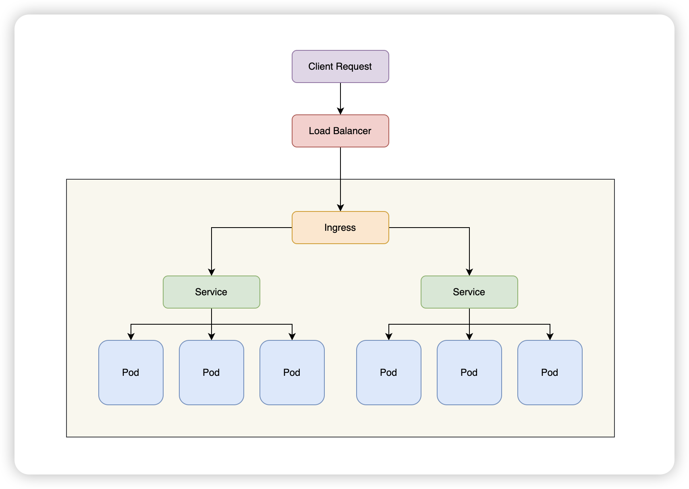
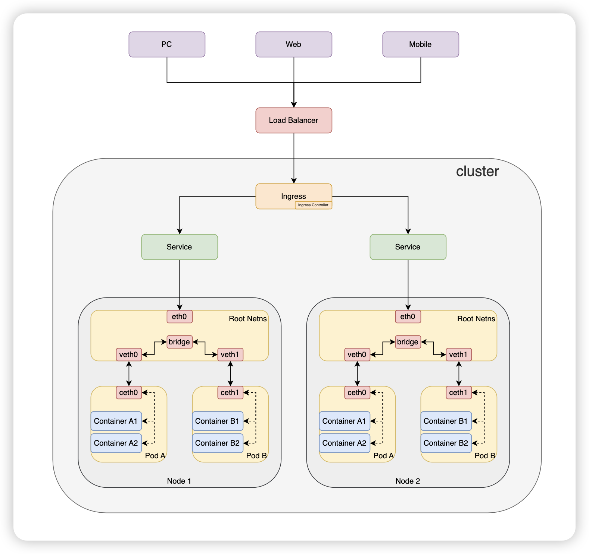

# k8s 架构


## 控制平面组件

- Scheduler：负责将未绑定到具体节点（Node）的 Pod 分配到集群中的合适节点上运行。

- Controller Manager：负责运行集群中所有的控制器逻辑。这些控制器通过不断监视集群的状态，与期望状态（定义在 Kubernetes 的资源对象中）进行比较，执行必要的操作以使实际状态逐步趋近期望状态。

  - ```c
    while True:
        desired_state = get_desired_state()  // 期望状态
        current_state = get_current_state()  // 当前状态
        if desired_state != current_state:
            make_changes_to_reach_desired_state()  // 执行步骤
    ```

  - 控制器类型

    - Node Controller：负责监控节点状态，发现节点不可用时进行标记。
    - Replication Controller：负责确保指定数量的 Pod 副本运行。
    - Endpoint Controller：更新 Service 和 Pod 之间的映射。
    - Job Controller：负责管理批处理作业（Job），确保指定数量的 Pod 完成任务。
    - ...

- Etcd：存储 Kubernetes 集群中的所有状态信息。

  - 集群的节点信息。
  - Pod、Service 等资源的定义。
  - 配置数据和元数据。

- Api Server：RESTful 接口服务，用于接收、验证、处理请求，并与集群状态存储（etcd）进行交互。


## Node 组件

- Kubelet：Kubernetes 工作负载在节点上调度和运行的关键代理程序。
  - 容器生命周期管理：Kubelet 通过容器运行时（如 Docker、containerd、CRI-O）负责管理 Pod 和容器的生命周期，包括创建、启动、停止和删除容器。
  - 与 API Server 通信。
    - 定期从 Kubernetes API Server 获取分配到本节点的 Pod 信息。
    - 报告节点和 Pod 的状态
  - 状态监控：监控本节点上运行的 Pod 和容器的状态，并将状态信息同步到 API Server。
  - 资源配置：根据 Pod 定义的 `spec` 配置资源（如 CPU、内存限制）和网络（如 CNI）。
  - 日志和诊断：收集容器运行日志，提供节点和 Pod 的诊断信息。
  - 实现 Pod 的健康检查。
    - 执行 Liveness 和 Readiness 探针，确保容器按预期运行。
    - 当容器不健康时，根据配置自动重启或其他操作。
- Kube-Proxy：运行在每个节点上的网络组件，负责实现服务的网络代理和负载均衡功能。
  - 服务通信管理：Kube-Proxy 根据 Kubernetes 服务的定义，为服务和后端 Pod 之间的通信提供代理和负载均衡。
  - 服务发现：动态更新和管理节点上的网络规则，使服务 IP（ClusterIP）始终指向正确的后端 Pod。
  - 负载均衡：在多个 Pod 实例之间分发请求，确保流量均匀分配。


## 插件

- DNS
- Dashboard
- 容器资源监控
- 集群层面日志


# Pod 与容器的关系

Pod 是一个抽象的逻辑概念。它是一组（一个或者多个）容器的集合，这些容器之间共享同一份存储、网络等资源。

当创建 Pod 时，会创建一个 Pause 容器，Pod 内的应用容器会共享 Pause 容器的命名空间。


## 手动模拟 Pod

### 创建 Pause 容器

```shell
sudo docker run -d -p 8888:80 \
        --ipc=shareable \
        --name fake_k8s_pod_pause \
        registry.cn-hangzhou.aliyuncs.com/google_containers/pause:3.6
```


### 创建 nginx 容器

```shell
cat <<EOF >> nginx.conf
error_log stderr;
events { worker_connections  1024; }
http {
    access_log /dev/stdout combined;
    server {
        listen 80 default_server;
        server_name iswbm.com www.iswbm.com;
        location / {
            proxy_pass http://127.0.0.1:2368;
        }
    }
}
EOF
```

然后运行如下命令创建名字 fake_k8s_pod_nginx 的 nginx 容器。

```shell
sudo docker run -d --name fake_k8s_pod_nginx \
        -v `pwd`/nginx.conf:/etc/nginx/nginx.conf \
        --net=container:fake_k8s_pod_pause \
        --ipc=container:fake_k8s_pod_pause \
        --pid=container:fake_k8s_pod_pause \
        nginx
```

- `--net`：指定 nginx 要 join 谁的 network namespace，当然是前面创建的fake_k8s_pod_pause
- `--ipc`：指定 ipc mode， 一样指定前面创建的fake_k8s_pod_pause
- `--pid`：指定 nginx 要 join 谁的 pid namespace，照旧是前面创建的fake_k8s_pod_pause


# Service 与 Ingress 的关系



- Service：
  - 用于将集群内部或外部的流量分发到一组 Pod 上。
  - 提供服务发现和负载均衡功能。
  - 类型：
    - **ClusterIP**（默认）：只能在集群内部访问，分配一个内部 IP 地址。
    - **NodePort**：通过每个节点的固定端口暴露服务，允许外部访问。
    - **LoadBalancer**：在云环境中，通过云提供商的负载均衡器暴露服务。
    - **ExternalName**：将流量映射到外部 DNS 名称。
- Ingress：
  - 提供 HTTP 和 HTTPS 路由，用于管理外部到集群内部的流量。
  - 允许基于路径（Path）或主机名（Host）的规则将流量路由到不同的 Service。
  - Ingress 依赖于一个 Ingress Controller（例如 NGINX、Traefik），它负责实际的流量转发。配置规则（如 URL 路由、TLS 配置）时，Ingress 是逻辑层，而 Ingress Controller 是实现层。

- 使用方式：

```yaml
apiVersion: networking.k8s.io/v1
kind: Ingress
metadata:
  name: example-ingress
spec:
  rules:
  - host: example.com
    http:
      paths:
      - path: /
        pathType: Prefix
        backend:
          service:
            name: example-service
            port:
              number: 80
```


# 一个 HTTP 外部请求到容器的过程




### **详细数据流总结**

| **步骤**                   | **组件**                                      | **作用**                                         |
| -------------------------- | --------------------------------------------- | ------------------------------------------------ |
| **1. 客户端请求**          | 客户端                                        | 发起 HTTP 请求。                                 |
| **2. 到达负载均衡**        | Load Balancer                                 | 统一网络请求入口。                               |
| **3. 到达集群入口**        | Ingress                                       | 接收外部请求，将其转发到 Kubernetes 集群内部。   |
| **4. 规则匹配（Ingress）** | Ingress                                       | 基于路径或主机名规则将流量路由到对应的 Service。 |
| **5. 流量转发**            | Service                                       | 将请求分发到关联的 Pod（内部负载均衡）。         |
| **6. 路由到 Pod**          | kube-proxy 或 IPVS                            | 确定目标 Pod 的 IP 和端口，转发流量。            |
| **7. 请求处理**            | Pod 中的容器                                  | 处理请求并生成响应。                             |
| **8. 返回响应**            | Pod → Service → Ingress/LoadBalancer → 客户端 | 按原路返回响应。                                 |


# 参考

- https://k8s.iswbm.com/c02/p02_learn-kubernetes-pod-via-pause-container.html
- https://juejin.cn/post/7317926149120114723
- https://kubernetes.io/zh-cn/docs/concepts/architecture/
- https://gist.github.com/baymaxium/f86b8920263dfaa42aaaace0b71cf039