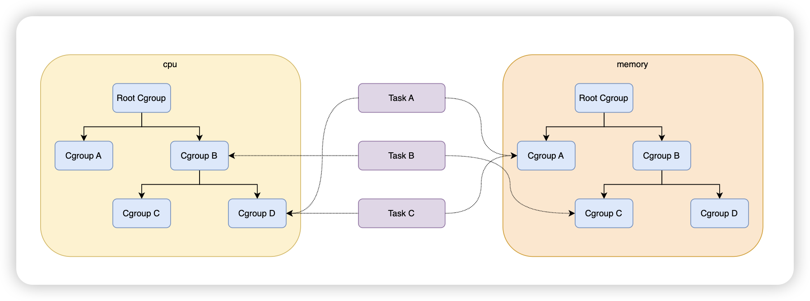

# 简介

**Cgroup（Control Group）** 是 Linux 内核提供的一种功能，用于限制、隔离和监控系统中进程的资源使用。Cgroup 支持对 CPU、内存、磁盘 I/O、网络带宽等系统资源进行精细化的管理。

一张图了解关系：




## 子系统类型：

一个子系统代表一类资源调度控制器。

- blkio：这个子系统为块设备设定输入/输出限制，比如物理设备（磁盘，固态硬盘，USB 等等）。
- cpu：这个子系统使用调度程序提供对 CPU 的 cgroup 任务访问。
- cpuacct：这个子系统自动生成 cgroup 中任务所使用的 CPU 报告。
- cpuset：这个子系统为 cgroup 中的任务分配独立 CPU（在多核系统）和内存节点。
- devices：这个子系统可允许或者拒绝 cgroup 中的任务访问设备。
- freezer：这个子系统挂起或者恢复 cgroup 中的任务。
- memory：这个子系统设定 cgroup 中任务使用的内存限制，并自动生成由那些任务使用的内存资源报告。
- net_cls：这个子系统使用等级识别符（classid）标记网络数据包，可允许 Linux 流量控制程序（**tc**）识别从具体 cgroup 中生成的数据包。
- ns：*名称空间*子系统。


# 动手创建 cpu 子系统 cgroup 

> 以 cgroup v1 为例

1. 创建 cpu 子系统层级

```shell
mkdir /sys/fs/cgroup/cpu/lab01_group
```

并非创建普通的目录，伪文件系统，操作系统封装细节。创建完成后执行 `ll` 命令可看到自动生成相关参数文件：


2. 设置 cpu 参数：

```shell
echo 100000 > /sys/fs/cgroup/cpu/lab01_group/cpu.cfs_period_us
echo 50000 > /sys/fs/cgroup/cpu/lab01_group/cpu.cfs_quota_us
```

> 表示允许实时任务在 `cpu.cfs_period_us` 时间段内可以使用 `cpu.cfs_quota_us` 的 CPU 时间，单位为微秒。
>
> 相当于单核 CPU 的 50% 使用率。

想分配两个核：`echo 200000 > /sys/fs/cgroup/cpu/lab01_group/cpu.cfs_quota_us`

3. 将进程 ID 加入控制组

```shell
echo <PID> > /sys/fs/cgroup/cpu/lab01_group/cgroup.procs
```

# 测试

编写测试脚本

`lab01_cgroup.sh`

```shell
#!/bin/bash
while true;do
    echo ""
done
```

使用 `sh ./lab01_cgroup.sh` 执行脚本。

可以看到 4219 进程的 cpu 占用率为 50%。


# 参考资料

- https://docs.redhat.com/en/documentation/red_hat_enterprise_linux/6/html/resource_management_guide/ch01
- https://www.cnblogs.com/zhrx/p/16388175.html