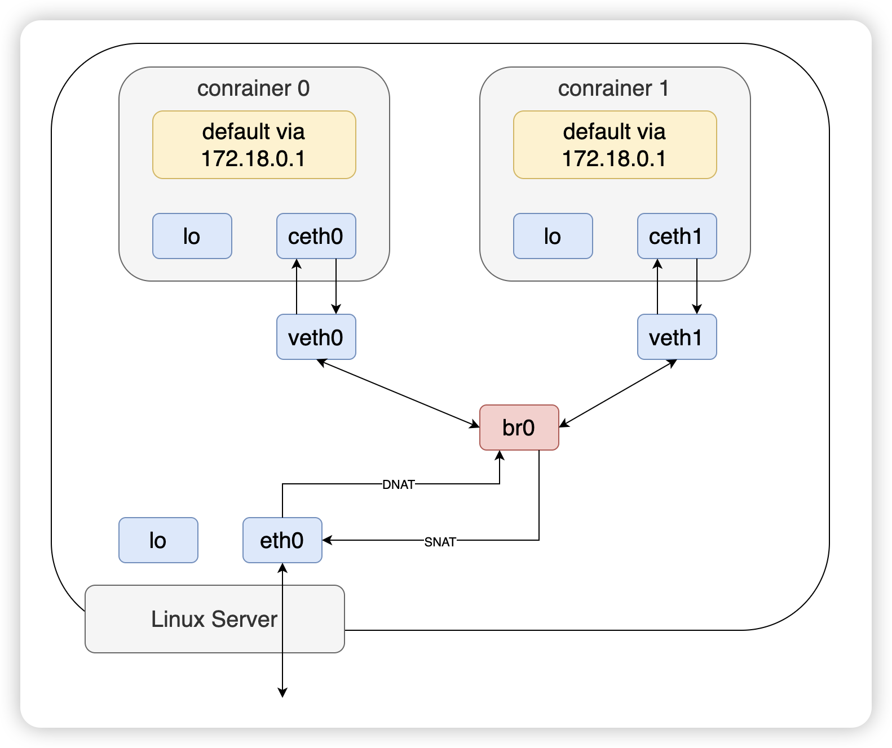
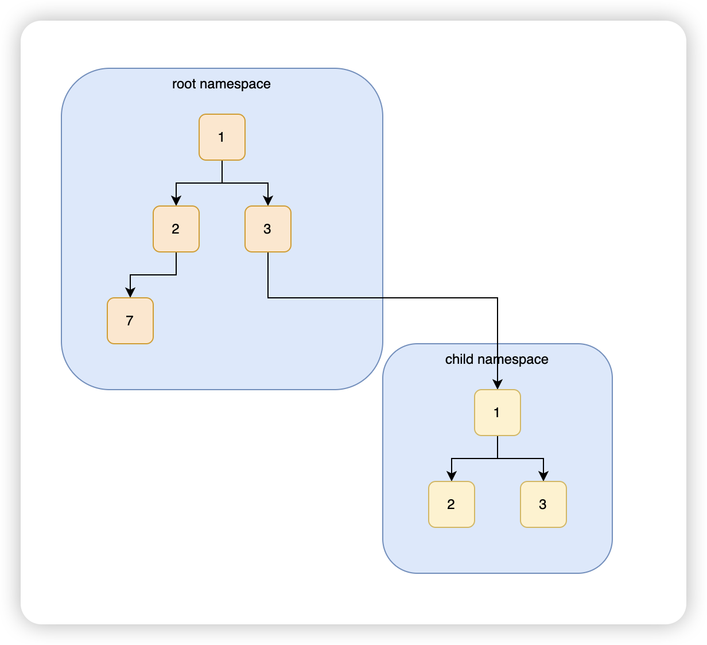

# 简介

Linux namespace 是一种内核级别的资源隔离机制，让运行在同一个操作系统上的进程互相不会干扰。改变一个namespace 中的系统资源只会影响当前 namespace 里的进程，对其他 namespace 中的进程没有影响。

# namespace 类型

| 名称    | 宏定义          | 隔离的内容                                                   |
| :------ | :-------------- | :----------------------------------------------------------- |
| IPC     | CLONE_NEWIPC    | System V IPC, POSIX message queues (since Linux 2.6.19)      |
| Network | CLONE_NEWNET    | network device interfaces, IPv4 and IPv6 protocol stacks, IP routing tables, firewall rules, the /proc/net and /sys/class/net directory trees, sockets, etc (since Linux 2.6.24) |
| Mount   | CLONE_NEWNS     | Mount points (since Linux 2.4.19)                            |
| PID     | CLONE_NEWPID    | Process IDs (since Linux 2.6.24)                             |
| User    | CLONE_NEWUSER   | User and group IDs (started in Linux 2.6.23 and completed in Linux 3.8) |
| UTS     | CLONE_NEWUTS    | Hostname and NIS domain name (since Linux 2.6.19)            |
| Cgroup  | CLONE_NEWCGROUP | Cgroup root directory (since Linux 4.6)                      |

## IPC 

进程间通讯的机制称为 IPC(Inter-Process Communication)。Linux 下有多种 IPC 机制：管道（PIPE）、命名管道（FIFO）、信号（Signal）、消息队列（Message queues）、信号量（Semaphore）、共享内存（Share Memory）、内存映射（Memory Map）、套接字（Socket）。

其中 IPC Namespace 使得运行在不同 IPC Namespace 中的进程之间无法通过 **共享内存、消息队列和信号量** 进行通信。

使用 `ipcs` 命令

```shell
ipcs
```

输出：

```shell
T     ID     KEY        MODE       OWNER    GROUP
Message Queues:

T     ID     KEY        MODE       OWNER    GROUP
Shared Memory:

T     ID     KEY        MODE       OWNER    GROUP
Semaphores:
```


## Network

Network Namespace 用来隔离网络环境，在 Network Namespace 中，网络设备、端口、套接字、网络协议栈、路由表、防火墙规则等都是独立的。

因为 Network Namespace 中具有独立的网络协议栈，因此每个 Network Namespace 中都有一个lo接口，但 lo 接口默认未启动，需要手动启动起来。

让某个 Network Namespace 和 Root Network Namespace 之间保持通信是一个非常常见的需求，这一般通过 Veth 虚拟设备实现。

用户可以将 Veth 的其中一端放在某个 Network Namespace 中，另一端保留在 Root  Network Namespace 中。这样就可以让用户创建的 Network Namespace 和宿主机通信。




## Mount

用户通常使用 mount 命令来挂载普通文件系统，但实际上 mount 能挂载的东西非常多，甚至连现在功能完善的 Linux 系统，其内核的正常运行也都依赖于挂载功能，比如挂载根文件系统`/`。其实所有的挂载功能和挂载信息都由内核负责提供和维护，mount 命令只是发起了 `mount()` 系统调用去请求内核。

内核将每个进程的挂载点信息保存在 `/proc/<pid>/{mountinfo,mounts,mountstats}` 三个文件中:

```shell
ls -l /proc/$$/mount*
```

输出：

```shell
-r--r--r-- 1 root root 0 Dec 16 05:54 /proc/75325/mountinfo
-r--r--r-- 1 root root 0 Dec 16 05:54 /proc/75325/mounts
-r-------- 1 root root 0 Dec 16 05:54 /proc/75325/mountstats
```

具有独立的挂载点信息，意味着每个mnt namespace可具有独立的目录层次，这在容器中起了很大作用：`容器可以挂载只属于自己的文件系统`。

当创建 Mount Namespace 时，内核将拷贝一份当前 Mount Namespace 的挂载点信息列表到新的 Mount Namespace 中，此后两个 Mount Namespace 就没有了任何关系。

```shell
#! /bin/bash

# 创建目录
mkdir -p iso/iso1/dir1 && mkdir -p iso/iso2/dir2

# 生成iso文件
cd iso && mkisofs -o 1.iso iso1 && mkisofs -o 2.iso iso2

# 挂载iso1
mkdir /mnt/{iso1,iso2} && mount 1.iso /mnt/iso1 && mount | grep iso1

# 创建mount+uts namespace
unshare -m -u /bin/bash

# 在namespace中挂载iso2
mount 2.iso2 /mnt/iso2/

# 查看挂载信息
echo "查看挂载信息\n\n"
mount | grep 'iso[12]'

# 卸载挂载, 此时看到没有iso1的挂载信息
umount /mnt/iso1/

echo "查看挂载信息\n\n"
mount | grep 'iso[12]'

# 新起一个terminal, 查看挂载信息没有iso2的挂载信息，但是还是有iso1的挂载信息
mount | grep 'ios[12]'
```


## PID

PID Namespace 是树状结构的，系统启动的时候，会创建一个 Root Namespace，在这个 Namespace 中可以新创建出子 Namespace，从而可以形成树状的层级关系。

> 思考一个问题：一个进程只有一个进程号吗？
>
> 答案：如果一个进程同时存在于多个嵌套的 PID Namespace 中，它将在每个命名空间有一个不同的 PID。




pid = 1的进程是每一个 PID Namespace 的核心进程(init进程)，它不仅负责收养其所在 PID Namespace 中的孤儿进程，还影响整个 PID Namespace 。

当 PID Namespace 中 pid = 1 的进程退出或终止，内核默认会发送 SIGKILL 信号给该 PID Namespace 中的所有进程以便杀掉它们(如果该 PID Namespace 中有子孙 Namespace ，也会直接被杀)。


## User

todo!


## UTS

UTS namespace 功能最简单，它只隔离了 hostname 和 NIS domain name 两个资源。同一个 namespace 里面的进程看到的 hostname 和 domain name 是相同的，这两个值可以通过 `sethostname(2)` 和 `setdomainname(2)` 来进行设置，也可以通过 `uname(2)`、`gethostname(2)` 和 `getdomainname(2)` 来读取。

> UTS 的名字来自于 `uname` 函数用到的结构体 `struct utsname`，这个结构体的名字源自于 `UNIX Time-sharing System`。

## Cgroup

todo!


# 三个系统调用

Linux 内核提供的功能都会提供系统调用接口供应用程序使用，namespace自然也不例外。和 Namespace 相关的系统调用主要有三个：`clone`、`setns`、`unshare`

## clone

创建一个新的子进程，然后让子进程加入新的namespace，而当前进程保持不变。

```c
int clone(int (*fn) (void *), void *child_stack, int flags, void *arg, ...);
```

- `fn` 参数是一个函数指针，子进程启动的时候会调用这个函数来执行。
- `child_stack` 参数指定了子进程stack开始的内存地址，因为stack都会从高位到地委增长，所以这个指针需要指向分配stack的最高位地址。
- `flags` 用来控制子进程的特性，比如新创建的进程是否与父进程共享虚拟内存等。比如可以传入`CLONE_NEWNS`标志使得新创建的新城拥有独立的 `Mount Namespace`，也可以传入多个flags如 `CLONE_NEWNS | CLONE_NEWUTS | CLONE_NEWIPC`。
- `arg` 作为 `fn` 函数的参数。


## setns

把某个进程加入到给定的namespace。

```c
int setns(int fd, int nstype);
```

- `fd` 参数是一个文件描述符，指向`/proc/[pid]/ns/`目录下的某个namespace，调用这个函数的进程就会被加入到`fd`指向文件所代表的namespace，`fd`可以通过打开namespace对应的文件获取 
- `nstype` 限定进程可以加入的namespace，可能的取值有：（如果不知道 fd指向的 namespace 类型，比如fd是其他进程打开的，然后在应用中希望明确指定特种类型的namespace，nstype就非常有用）
  - 0：可以加入任意的namespace
  - `CLONE_NEWIPC`：fd 必须指向`IPC namespace`
  - `CLONE_NEWNET`：fd 必须指向`network namespace`
  - `CLONE_NEWNS`：fd 必须指向`mount namespace`
  - `CLONE_NEWPID`：fd 必须指向`PID namespace`
  - `CLONE_NEWUSER`： fd 必须指向`user namespace`
  - `CLONE_NEWUTS`： fd 必须指向`UTS namespace`


## unshare

将当前进程和所在的namespace分离，只需要指定想要分离的namespace即可。

```c
int unshare(int flags);
```

- flags，它的含义和 clone 的 flags 相同。
  - `CLONE_FILES`: 子进程一般会共享父进程的文件描述符，如果子进程不想共享父进程的文件描述符了，可以通过这个flag来取消共享。
  - `CLONE_FS`: 使当前进程不再与其他进程共享文件系统信息。
  - `CLONE_SYSVSEM`: 取消与其他进程共享SYS V信号量。
  - `CLONE_NEWIPC`: 创建新的`ipc namespace`，并将该进程加入进来。


# 参考

- https://tinylab.org/ipc-namespace/
- https://fafucoder.github.io/2020/05/09/linux-namespace/
- https://tinylab.org/mnt-namespace/
- https://theboreddev.com/understanding-linux-namespaces/
- https://cizixs.com/2017/08/29/linux-namespace/
- https://www.cnblogs.com/f-ck-need-u/p/17718768.html

