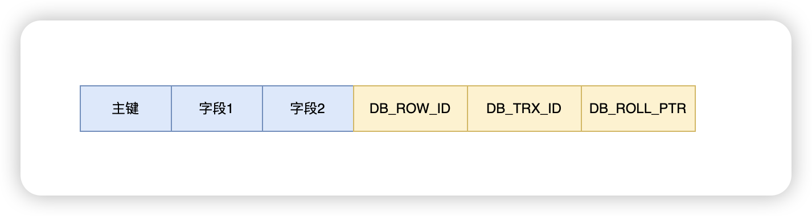
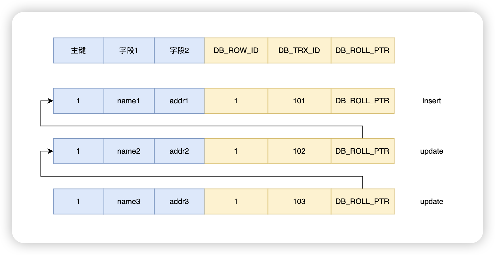

# 两个预备知识

## 1、插入记录的时候会增加系统字段

```c
void dict_table_add_system_columns(dict_table_t *table, mem_heap_t *heap) {
  ...
  dict_mem_table_add_col(table, heap, "DB_ROW_ID", DATA_SYS,
                         DATA_ROW_ID | DATA_NOT_NULL, DATA_ROW_ID_LEN, false,
                         phy_pos, v_added, v_dropped);

  dict_mem_table_add_col(table, heap, "DB_TRX_ID", DATA_SYS,
                         DATA_TRX_ID | DATA_NOT_NULL, DATA_TRX_ID_LEN, false,
                         phy_pos, v_added, v_dropped);

  if (!table->is_intrinsic()) {
    dict_mem_table_add_col(table, heap, "DB_ROLL_PTR", DATA_SYS,
                           DATA_ROLL_PTR | DATA_NOT_NULL, DATA_ROLL_PTR_LEN,
                           false, phy_pos, v_added, v_dropped);

    /* This check reminds that if a new system column is added to
    the program, it should be dealt with here */
  }
}
```

> DB_ROW_ID：行 ID
>
> DB_TRX_ID：事务 ID
>
> DB_ROLL_PTR：回滚指针

即：



## 2、一条 update 语句执行的大概过程

1. SQL 解析与优化
2. 执行阶段
   1. 加锁（行锁、间隙锁）
   2. 查找目标记录（索引/B+树）
   3. 读取数据并校验可见性（MVCC）
   4. 生成 Undo Log
   5. 更新行记录的 DB_TRX_ID 为当前的事务 ID，并更新需要更新的字段。
   6. 写入 Redo Log（内存）
   7. 准备 Binlog 缓存
3. 事务提交
   1. Redo Log 刷盘
   2. Binlog 写入磁盘
   3. 提交完成，释放锁
4. 事务解锁 & Undo Log 清理


# Redo Log

日志格式


通过 `show engine innodb status` 可以查看 `last checkpoint at `。

```
---
LOG
---
Log sequence number          32970011
Log buffer assigned up to    32970011
Log buffer completed up to   32970011
Log written up to            32970011
Log flushed up to            32970011
Added dirty pages up to      32970011
Pages flushed up to          32970011
Last checkpoint at           32970011
Log minimum file id is       10
Log maximum file id is       10
24 log i/o's done, 0.00 log i/o's/second
```

每次把 `buffer pool` 中页数据到磁盘的时候，都会更新 `checkpoint`。

`Last checkpoint at` 就是系统最后一次刷新 `buffer pool` 中页数据到磁盘的 `checkpoint`，`checkpoint` 是和 `redo log` 进行关联操作的。

当系统崩溃重启时。先找到最后一次 `last checkpoint lsn`，然后日志文件中所有大于该 `lsn` 的日志都是需要被恢复的数据。


# Undo Log

日志格式



先 insert 一条语句，在 update 两次，就可以得到上述回滚日志，也得到一个版本链。

# MVCC

`ReadView` 结构

```c
class ReadView {
  /** The read should not see any transaction with trx id >= this
  value. In other words, this is the "high water mark". */
  trx_id_t m_low_limit_id;

  /** The read should see all trx ids which are strictly
  smaller (<) than this value.  In other words, this is the
  low water mark". */
  trx_id_t m_up_limit_id;

  /** trx id of creating transaction, set to TRX_ID_MAX for free
  views. */
  trx_id_t m_creator_trx_id;

  /** Set of RW transactions that was active when this snapshot
  was taken */
  ids_t m_ids;
};
```

> m_low_limit_id：事务 id 大于 m_low_limit_id 的记录不可见。
>
> m_up_limit_id：事务 id 小于 m_up_limit_id 的记录可见。
>
> m_creator_trx_id：创建当前快照的事务 id。
>
> m_ids：当前快照产生时，活跃（未提交）的事务 id 集合。
>
> - 事务 id 存在 m_ids 时：表明产生快照数据时，该事务还未提交。不可见
>
> - 事务 id 不存在 m_ids 时：表明产生快照数据时，该事务已经提交。可见


## MVCC 结合 Undo Log 来分析一个场景。

A session 和 B session 各开启一个事务，假设 A 事务 ID 为 100，B 事务 ID 为 101。

B session 执行一个更新（未提交）。


此时的 Undo Log 如下：


此时 A 事务执行一个查询。此时会生成一个快照

```c
class ReadView {
  
  trx_id_t m_low_limit_id = 102;

  trx_id_t m_up_limit_id = 99;// 假定

  trx_id_t m_creator_trx_id = 100;

  ids_t m_ids = 101;
};
```

那么：

- 事务 ID 为 90 的记录小于 `m_up_limit_id` 且不在 `m_ids` 集合中，所以可以看到事务 ID 为 90 的记录
- 事务 ID 为 101 的记录虽然小于 `m_low_limit_id` 但是在  `m_ids` 集合中，所以不可以看到事务 ID 为 101 的记录

## 再来分析一个幻读场景


A session 先对 t1 开启一个主键等值查询 `select * from t1 where id = 10000`。查询结果为空。假设 A 事务 ID 为 500。

B session 先对 t1 进行一个 `insert` 操作 `insert into t1 value(10000, 10000);`。假设 B 事务 ID 为 501。

此时 A session 再对 t1 执行一个主键等值查询 `select * from t1 where id = 10000`。查询结果依然为空。这是因为进行快照读。


此时 A session 对 t1 表执行一个 `update` 操作 `update t1 set num = 20000 where id = 10000;`。

- update 操作会执行当前读，所以可以获取到 `id = 10000` 的记录。
- 那么 `id = 10000` 的记录的事务 ID 会被更新为 A 事务的事务 ID，即 500。
- 对  `id = 10000`  的记录执行字段更新。


再次发起查询的时候：

```c
class ReadView {
  
  trx_id_t m_low_limit_id = 502;

  trx_id_t m_up_limit_id = 99;// 假定

  trx_id_t m_creator_trx_id = 500;

  ids_t m_ids = [...];
};
```


此时：`m_creator_trx_id ` = 500，自然可以看到版本链上事务 ID = 500 的最新记录。

# 参考资料

- https://cloud.tencent.com/developer/article/1903487
- https://developer.aliyun.com/article/928196
- https://juejin.cn/post/6871046354018238472
- https://blog.csdn.net/weixin_30342639/article/details/107552255