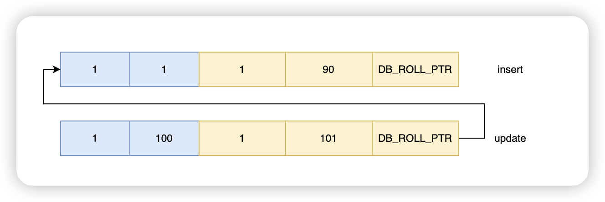

# 两个预备知识

## 1、插入记录的时候会增加系统字段

```c
void dict_table_add_system_columns(dict_table_t *table, mem_heap_t *heap) {
  ...
  dict_mem_table_add_col(table, heap, "DB_ROW_ID", DATA_SYS,
                         DATA_ROW_ID | DATA_NOT_NULL, DATA_ROW_ID_LEN, false,
                         phy_pos, v_added, v_dropped);

  dict_mem_table_add_col(table, heap, "DB_TRX_ID", DATA_SYS,
                         DATA_TRX_ID | DATA_NOT_NULL, DATA_TRX_ID_LEN, false,
                         phy_pos, v_added, v_dropped);

  if (!table->is_intrinsic()) {
    dict_mem_table_add_col(table, heap, "DB_ROLL_PTR", DATA_SYS,
                           DATA_ROLL_PTR | DATA_NOT_NULL, DATA_ROLL_PTR_LEN,
                           false, phy_pos, v_added, v_dropped);

    /* This check reminds that if a new system column is added to
    the program, it should be dealt with here */
  }
}
```

> DB_ROW_ID：行 ID
>
> DB_TRX_ID：事务 ID
>
> DB_ROLL_PTR：回滚指针

即：


## 2、一条 update 语句执行的大概过程

1. SQL 解析与优化
2. 执行阶段
   1. 加锁（行锁、间隙锁）
   2. 查找目标记录（索引/B+树）
   3. 读取数据并校验可见性（MVCC）
   4. 生成 Undo Log
   5. 更新行记录的 DB_TRX_ID 为当前的事务 ID，并更新需要更新的字段。
   6. 写入 Redo Log（内存）
   7. 准备 Binlog 缓存
3. 事务提交
   1. Redo Log 刷盘
   2. Binlog 写入磁盘
   3. 提交完成，释放锁
4. 事务解锁 & Undo Log 清理


# Binlog

Binlog 是逻辑日志，记录内容是语句的原始逻辑，属于 `Server` 层，为数据库主备与集群提供了能力。

## 记录格式

- Statement
  - 记录的内容是 `SQL` 语句原文。比如执行一条 `update T set update_time=now() where id=1` 。同步数据时，会执行记录的`SQL`语句，但是有个问题，`update_time=now()`这里会获取当前系统时间，会导致与原库的数据不一致。
- Row
  - 刚好解决了 Statement 产生的问题。记录的内容不再是简单的`SQL`语句了，还包含操作的具体数据。`update_time=now()` 变成了具体的时间 `update_time=1627112756247` 。
  - 但是这种格式，需要更大的容量来记录，比较占用空间，恢复与同步时会更消耗 IO 资源，影响执行速度。
- Mixed
  - 属于一种折中方案。MySQL 会判断这条 `SQL` 语句是否可能引起数据不一致，如果是，就用 `row` 格式，否则就用 `statement` 格式。

## 写入时机

- 事务执行过程中，先把日志写到 `Binlog Cache` ，事务提交的时候，再把 `Binlog Cache` 写到 `Binlog` 文件中。

- 因为一个事务的 `Binlog` 不能被拆开，无论这个事务多大，也要确保一次性写入，所以系统会给每个线程分配一个块内存作为 `Binlog Cache`。

- 我们可以通过 `binlog_cache_size` 参数控制单个线程 `Binlog Cache` 大小，如果存储内容超过了这个参数，就要暂存到磁盘（`Swap`）。


使用 `sync_binlog` 参数控制写盘时机

- 当 `sync_binlog = 1` 时，MySQL 会在每次事务提交后，将 `binlog_cache`中的数据更新到磁盘上，此时MySQL安全性较高，但是IO消耗也较高。
- 当 `sync_binlog = 0` 时，MySQL 会在每次事务提交后，将 `binlog_cache` 中的数据更新至文件系统缓冲区，但不会进行持久化，而是依赖操作系统来调度数据刷入磁盘。
- 当 `sync_binlog = N` 时，MySQL 会在每 N 组事务提交后将数据更新到磁盘中。通过这种方式，可以在一定程度上平衡 MySQL 的性能和数据的安全性。如果N设置得比较大，可以提高系统的性能，但会降低数据的安全性。


# Redo Log

Redo log（重做日志）是 InnoDB 存储引擎独有的，它让 MySQL 拥有了崩溃恢复能力。也保证了事务的持久性。

MySQL 中数据是以页为单位，查询一条记录，会从硬盘把一页的数据加载出来，加载出来的数据叫数据页，会放入到 `Buffer Pool` 中。

后续的查询都是先从 `Buffer Pool` 中找，没有命中再去硬盘加载，减少硬盘 IO 开销，提升性能。

更新表数据的时候，也是如此，发现 `Buffer Pool` 里存在要更新的数据，就直接在 `Buffer Pool` 里更新。

然后会把 ”在某个数据页上做了什么修改“ 记录到重做日志缓存（`redo log buffer`）里，接着刷盘到 Redo Log 文件里。


## 日志格式：


## 刷盘时机

- 事务提交时，可根据 `innodb_flush_log_at_trx_commit` 参数控制
  - 0：每秒执行一次刷新到磁盘的操作。
  - 1：每次事务提交的时候，刷新到磁盘。（默认）
  - 2：每次事务提交时都只把 log buffer 里的 redo log 内容写入 page cache，由操作系统决定什么时候写入磁盘。
- Log Buffer 空间占用达到一定比例时，会触发写盘。
- Checkpoint，InnoDB 定期会执行检查点操作，每次把 `buffer pool` 中页数据到磁盘的时候，都会更新 `checkpoint`，并且会将相应的重做日志一同刷新，以确保数据的一致性。
- 正常关闭服务器，MySQL 关闭的时候，redo log 都会刷入到磁盘里去。


## 崩溃重启时

通过 `show engine innodb status` 可以查看当前 `last checkpoint at `。

```
---
LOG
---
Log sequence number          32970011
Log buffer assigned up to    32970011
Log buffer completed up to   32970011
Log written up to            32970011
Log flushed up to            32970011
Added dirty pages up to      32970011
Pages flushed up to          32970011
Last checkpoint at           32970011
Log minimum file id is       10
Log maximum file id is       10
24 log i/o's done, 0.00 log i/o's/second
```

`Last checkpoint at` 就是系统最后一次刷新 `buffer pool` 中页数据到磁盘的 `checkpoint`，`checkpoint` 是和 `redo log` 进行关联操作的。

当系统崩溃重启时。先找到最后一次 `last checkpoint lsn`，然后日志文件中所有大于该 `lsn` 的日志都是需要被恢复的数据。


## 两阶段提交

如果只有 `Redo Log` 或者只有 `Binlog`，那么事务就不需要两阶段提交。但是如果同时使用了 `Redo Log` 和 `Binlog`，那么就需要保证这两种日志之间的一致性。否则，在数据库发生异常重启或者主从切换时，可能会出现数据不一致的情况。

- 在准备阶段，MySQL 先将数据修改写入 `Redo Log` ，并将其标记为 `prepare` 状态，表示事务还未提交。然后将对应的SQL语句写入`Binlog`。
- 在提交阶段，MySQL将 `Redo Log` 标记为 `commit` 状态，表示事务已经提交。然后根据 `sync_binlog` 参数的设置，决定是否将 `Binlog` 刷入磁盘。


# Undo Log

`Undo Log` 属于引擎层的日志。每一个事务对数据的修改都会被记录到 `Undo Log` ，当执行事务过程中出现错误或者需要执行回滚操作的话，MySQL 可以利用 `Undo Log` 将数据恢复到事务开始之前的状态。确保了事务的原子性。同时也支持了 MVCC 特性。


Undo Log 会写盘吗？

> 在系统崩溃或异常中断后，MySQL 的 InnoDB 存储引擎会使用 Redo Log 恢复提交事务的修改，并使用 Undo Log 回滚未提交事务的修改。
>
> 如果 Undo Log 不写盘，系统宕机后内存中的 Undo Log 会丢失，这样就无法正确回滚事务。
>
> 刷盘时机同Redo Log。


日志格式


先 insert 一条语句，在 update 两次，就可以得到上述回滚日志，也得到一个版本链。


# MVCC

## ReadView 

```c
class ReadView {
  /** The read should not see any transaction with trx id >= this
  value. In other words, this is the "high water mark". */
  trx_id_t m_low_limit_id;

  /** The read should see all trx ids which are strictly
  smaller (<) than this value.  In other words, this is the
  low water mark". */
  trx_id_t m_up_limit_id;

  /** trx id of creating transaction, set to TRX_ID_MAX for free
  views. */
  trx_id_t m_creator_trx_id;

  /** Set of RW transactions that was active when this snapshot
  was taken */
  ids_t m_ids;
};
```

> m_low_limit_id：事务 id 大于 m_low_limit_id 的记录不可见。
>
> m_up_limit_id：事务 id 小于 m_up_limit_id 的记录可见。
>
> m_creator_trx_id：创建当前快照的事务 id。
>
> m_ids：当前快照产生时，活跃（未提交）的事务 id 集合。
>
> - 事务 id 存在 m_ids 时：表明产生快照数据时，该事务还未提交。不可见
>
> - 事务 id 不存在 m_ids 时：表明产生快照数据时，该事务已经提交。可见


## 当前读与快照读

- 快照读
  - 在 `Repeatable Read` 和 `Read Committed` 隔离级别下，执行普通的 `select` 语句，会通过 MVCC 的方式读，读区快照数据。
- 当前读
  - `select ... for share;`
  - `select ... for update;`
  - `insert`、`update`、`delete`
  - 在当前读下，读取的是数据的最新版本，会读记录加 S 锁或者 X 锁。

在有 MVCC 的情况下，即使当前读会上锁，执行普通 `select` 依然可以查询到快照上的数据，不仅解决了不可重复读和部分情况下的幻读。也提升了性能。

## MVCC 结合 Undo Log 来分析一个场景。

A session 和 B session 各开启一个事务，假设 A 事务 ID 为 100，B 事务 ID 为 101。

B session 执行一个更新（未提交）。


此时的 Undo Log 如下：



此时 A 事务执行一个查询。此时会生成一个快照

```c
class ReadView {
  
  trx_id_t m_low_limit_id = 102;

  trx_id_t m_up_limit_id = 99;// 假定

  trx_id_t m_creator_trx_id = 100;

  ids_t m_ids = 101;
};
```

那么：

- 事务 ID 为 90 的记录小于 `m_up_limit_id` 且不在 `m_ids` 集合中，所以可以看到事务 ID 为 90 的记录
- 事务 ID 为 101 的记录虽然小于 `m_low_limit_id` 但是在  `m_ids` 集合中，所以不可以看到事务 ID 为 101 的记录

## 再来分析一个幻读场景


A session 先对 t1 开启一个主键等值查询 `select * from t1 where id = 10000`。查询结果为空。假设 A 事务 ID 为 500。

B session 先对 t1 进行一个 `insert` 操作 `insert into t1 value(10000, 10000);`。假设 B 事务 ID 为 501。

此时 A session 再对 t1 执行一个主键等值查询 `select * from t1 where id = 10000`。查询结果依然为空。这是因为进行快照读。


此时 A session 对 t1 表执行一个 `update` 操作 `update t1 set num = 20000 where id = 10000;`。

- update 操作会执行当前读，所以可以获取到 `id = 10000` 的记录。
- 那么 `id = 10000` 的记录的事务 ID 会被更新为 A 事务的事务 ID，即 500。
- 对  `id = 10000`  的记录执行字段更新。


再次发起查询的时候：

```c
class ReadView {
  
  trx_id_t m_low_limit_id = 502;

  trx_id_t m_up_limit_id = 99;// 假定

  trx_id_t m_creator_trx_id = 500;

  ids_t m_ids = [...];
};
```


此时：`m_creator_trx_id ` = 500，自然可以看到版本链上事务 ID = 500 的最新记录。

# 参考资料

- https://cloud.tencent.com/developer/article/1903487
- https://developer.aliyun.com/article/928196
- https://juejin.cn/post/6871046354018238472
- https://blog.csdn.net/weixin_30342639/article/details/107552255
- https://help.aliyun.com/zh/rds/apsaradb-rds-for-mysql/innodb-flush-log-at-trx-commit
- https://javaguide.cn/database/mysql/mysql-logs.html