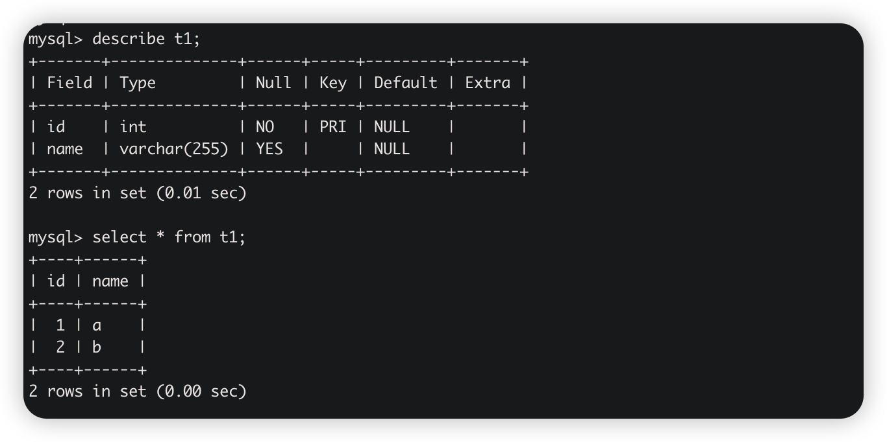
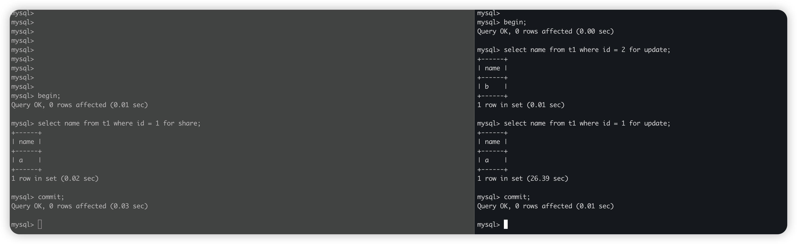

本文来分析 Mysql 锁，从 server 层和引擎层两个层面展开。

> Version： >= 8.0
>
> 存储引擎：Innodb 

# Server 层的锁

- Table Locks
- Meta Data Locks

## Table Locks（表锁）

### 加锁/解锁 SQL

对表 t1 加读锁（共享锁）

```sql
lock table t1 read;

unlock table;
```

对表 t1 加写锁（排它锁）

```sql
lock table t1 write;

unlock table;
```

> 解锁必须使用与加锁相同的 session，或者关闭对应的线程。

### 验证表锁（写）

表结构描述



A session 对表 t1 加写锁，B session 对 t1 执行查询，B session 被阻塞；


A session 对表 t1 解锁，B session 查询到数据；


## Meta Data Locks（元数据锁）

在执行 DDL 会对表加元数据锁。

### 验证元数据锁

A session 对表 t1 开启一个查询事物，然后 B session 对表 t1 执行 DDL 语句，使用 `show processlist` 查看，可以发现 `Waiting for table metadata lock | alter table t1 add column email varchar(20) null`。


A session 执行 commit，B session 执行 DDL 完成。


# 引擎层（Innodb）的锁

- Shared and Exclusive Locks
- Intention Locks
- Record Locks
- Gap Locks
- Next-Key Locks
- Insert Intention Locks
- AUTO-INC Locks

## Shared and Exclusive Locks（共享锁与排它锁）

共享锁与排它锁，属于行级别的锁，S 锁仅可以 S 锁共存。

### 加锁语句

- 共享锁

  ```sql
  SELECT ... FOR SHARE;
  ```

- 排它锁

  ```sql
  SELECT ... FOR UPDATE;
  ```

### 验证共享锁与排它锁

表结构描述


表 t1 中 id 为主键。

首先 A session 对 id 为 1 的记录加共享锁，

​	B session 对 id 为 2 的记录加排它锁，加锁成功。

​	B session 对 id 为 1 的记录加排它锁，阻塞。


A session 执行 commit，B session 对 id 为 1 的记录加锁成功。



## Intention Locks（意向锁）

Innodb 支持多粒度锁定，允许表锁和行锁共存。意向锁属于表级别锁。

- 一个事物获取共享锁之前，必须获取一个意向共享锁。

- 一个事物获取排它锁之前，必须获取一个意向排它锁。
- 意向锁之间不互斥。


到底该如何理解意向锁呢？

首先明确一个前提：意向锁是引擎层维护的，用户无法直接操作意向锁！

我们将意向 `排它锁` 与 `排它锁` 结合 server 层的 `表读锁（共享锁）` 结合来看。

1. A session 对 t1 执行 `select * from t1 where id = 1 for update;` 
   - 此时会对 t1 表中 id = 1 的行加 `排它锁`。
   - 同时，会对 t1 表加 `意向排它锁`。
2. B session 对 t1 执行 `lock table t1 read;`
   - 此时，B session 当前会阻塞。因为 t1 表上的 `意向排它锁` 与当前 session 想获取的`共享锁`互斥。

> 这么做的好处是什么呢？
>
> 在上面例子里：B session 想获取 t1 表的共享锁（读锁），发现当前表上有意向排它锁，就可以直接阻塞，就省下来去查找表中是否存在行级别的排它锁的步骤。

可以下一个结论：<font color = red>意向锁本身不锁住任何东西，只是在表上打了一个标记。</font>

## Record Locks & Gap Locks & Next-Key Locks（记录锁）

> Record Locks & Gap Locks & Next-Key Locks 都属于记录锁
>
> 记录锁锁的是什么？
>
> 记录锁锁的是索引上的记录。

- X,GAP：<font color = red>锁的是当前记录之前的间隙，不包含当前记录</font>。即：Gap Locks
- X：<font color = red>锁定的是当前记录以及当前记录的间隙</font>。即：Next-Key Locks
- X,REC_NOT_GAP：<font color = red>锁定的是当前记录，不包含间隙</font>。即：Record Locks

```sql
CREATE TABLE `t1` (
  `id` int NOT NULL,
  `num` int DEFAULT NULL,
  PRIMARY KEY (`id`),
  KEY `idx_num` (`num`) USING BTREE
) ENGINE=InnoDB DEFAULT CHARSET=utf8mb4 COLLATE=utf8mb4_general_ci;
```


### case 1：对主键进行等值查询

表 t1 中 id 为主键（唯一索引）


可以看到对主键索引上的 1 加 `Record Locks`。

### case 2：对非唯一索引进行等值查询


对于表 t1 现有数据，可得：

- Idx_num 索引：
  - 锁定区间 (5，7) 。加 Gap Locks。
  - 锁定区间 (2，5]。加 Next-Key Locks。
- 主键索引：
  - 锁定记录 5。加 Record Locks。

执行 `insert into t1 value(6, 6);` 就 idx_num 索引而言， 6 在 (2, 7) 区间，所以 insert 语句阻塞。


### case 3：对非唯一索引进行范围查询


对于表 t1 现有数据，可得：

- Idx_num 索引：
  - 锁定区间 (7，+∞)。加 Gap Locks。
  - 锁定区间 (5，7]。加 Next-Key Locks。
- 主键索引：
  - 锁定记录 7。加 Record Locks。

## Insert Intention Locks（插入意向锁）


可以看到在执行 `insert into t1 value(3, 3)` 的 session 在等待获取间隙 (2, 5) 的插入意向锁。

## AUTO-INC Locks（自增锁）

属于表级别锁，自增列获取值时会尝试获取 AUTO-INC Locks。

# 参考资料
- https://juejin.cn/post/6844903666332368909
- https://weikeqin.com/2019/09/05/mysql-lock-table-solution/
- https://dev.mysql.com/doc/refman/8.4/en/innodb-locking.html