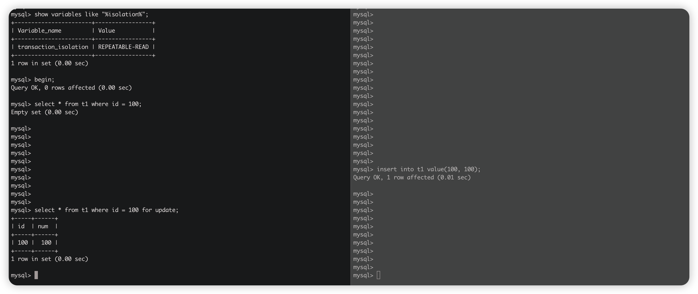

# 什么是事务

> Transactions are atomic units of work that can be ***committed*** or ***rolled back***. When a transaction makes multiple changes to the database, either all the changes succeed when the transaction is committed, or all the changes are undone when the transaction is rolled back.
>
> Database transactions, as implemented by `InnoDB`, have properties that are collectively known by the acronym ***ACID***, for atomicity, consistency, isolation, and durability.

# 事务有什么特性

- Atomicity（手段）：一个事务中的所有操作，要么全部完成，要么全部失败。
  - 通过 undo log 保证。undo log 记录回滚信息。
    - 全部成功，直接提交即可。
    - 全部失败，根据 undo log 进行回滚即可。

- Isolation（手段）：数据库允许多个并发事务同时对数据进行读写和修改的能力，且事务之间不会互相干扰。
  - 通过 mvcc 和锁机制保证。

- Durability（手段）：事务处理结束后，对数据的修改就是永久的，即便系统故障也不会丢失。
  - 通过 redo log 保证。事务提交之前会先通过顺序 io 写 redo log 并且持久化到磁盘。
- consistency（目的）：是指事务操作前和操作后，数据满足完整性约束，数据库保持一致性状态。
  - 通过原子性+隔离性+持久性完成一致性。

# 为什么需要隔离级别

在事务并发时，可能出现的问题：

- 脏读：一个事务读到了另一个事务执行但未提交的数据。
- 不可重复读：同一个事务中，前后两次读区到的记录内容不一样。针对 update 操作。
- 幻读：同一个事务中，前后两次读区到的记录数量不一样。针对 insert 和 delete 操作。

事务隔离级别的出现就是为了解决以上问题。

# 隔离级别有哪些

## 读未提交

> 指一个事务可以读取到另一个事务未提交的数据，当前隔离级别下，脏读、不可重复读、幻读都会出现。

## 读已提交

> 指一个事务可以读取到另一个事务提交的数据，当前隔离级别下，不可重复读、幻读都会出现。

通过 mvcc 的方式，每次读取的时候，读最新的数据。与可重复读的区别是，可重复读是在事务开启的那一刻读取到一个快照，后面再次读取的时候，仅读区这个快照。

## 可重复读（默认）

> 指一个事务前后多次读取到的记录内容和记录数量一致。Innodb 通过 mvcc 和锁机制保证了脏读和不可重复读不会发生。
>
> 最大程度上保证了幻读不会发生。

- 对于快照读，通过 mvcc 快照的方式保证不会发生幻读。
- 对于当前读，通过加锁的方式保证不会发生换读。

先模拟一种幻读场景：即先快照读，再当前读。

(todo! 还有一种场景，等我们写完 mvcc 的时候再模拟)

出现的原因本质上是因为：第一次读是快照读，第二次读是当前读。导致出现幻读现象。

## 串行化

> 事务按照串行的方式执行，自然不会发生脏读、不可重复读、幻读的问题。

# 总结

|          | 脏读 | 不可重复读 | 幻读     |
| -------- | ---- | ---------- | -------- |
| 读未提交 | ☑️    | ☑️          | ☑️        |
| 读已提交 | ❌    | ☑️          | ☑️        |
| 可重复读 | ❌    | ❌          | 部分解决 |
| 串行化   | ❌    | ❌          | ❌        |

# 参考资料

- https://dev.mysql.com/doc/refman/8.4/en/mysql-acid.html
- https://www.xiaolincoding.com/mysql/transaction/mvcc.html