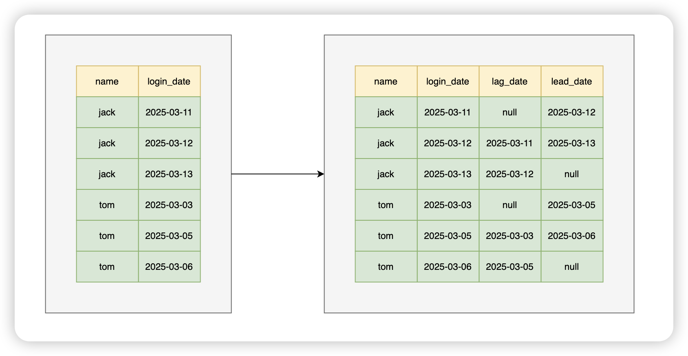
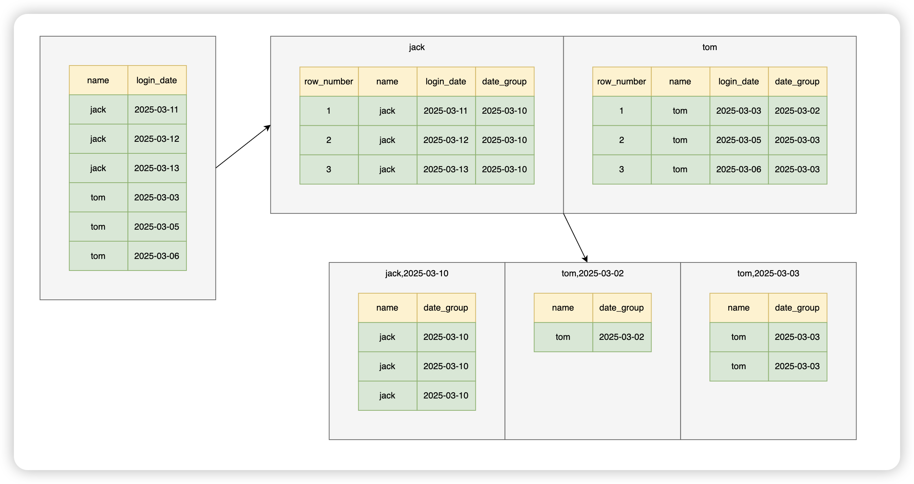

创建表

```sql
CREATE TABLE `login_info` (
  `id` int NOT NULL AUTO_INCREMENT,
  `name` varchar(255) NOT NULL,
  `login_date` date NOT NULL,
  PRIMARY KEY (`id`)
) ENGINE=InnoDB AUTO_INCREMENT=8 DEFAULT CHARSET=utf8mb4 COLLATE=utf8mb4_0900_ai_ci;
```

插入数据

```sql
INSERT INTO `login_info` (`id`, `name`, `login_date`) VALUES (1, 'jack', '2025-03-11');
INSERT INTO `login_info` (`id`, `name`, `login_date`) VALUES (2, 'jack', '2025-03-12');
INSERT INTO `login_info` (`id`, `name`, `login_date`) VALUES (3, 'jack', '2025-03-13');
INSERT INTO `login_info` (`id`, `name`, `login_date`) VALUES (4, 'tom', '2025-03-03');
INSERT INTO `login_info` (`id`, `name`, `login_date`) VALUES (5, 'tom', '2025-03-05');
INSERT INTO `login_info` (`id`, `name`, `login_date`) VALUES (6, 'tom', '2025-03-06');
```

## 查询连续登陆超过三天的用户

### 方案1:

```sql
# 方案1
SELECT DISTINCT
	`name` 
FROM
	(
	SELECT
		`name`,
		login_date,
		lag( login_date, 1 ) over ( PARTITION BY `name` ORDER BY login_date ) AS lag_date,
		lead( login_date, 1 ) over ( PARTITION BY `name` ORDER BY login_date ) AS lead_date 
	FROM
		login_info 
	) t 
WHERE
	login_date = date_add( lag_date, INTERVAL 1 DAY ) 
	AND login_date = date_sub( lead_date, INTERVAL 1 DAY );
```

对 login_date 排序后，分别使用 lag 和 lead 函数查询出上一个和下一个 login_date 作为辅助列，产生一个结果，然后在对这个结果进行过滤。（mysql 8.0）



### 方案2:

```sql
# 方案2
SELECT DISTINCT
	l1.`name` 
FROM
	login_info l1
	JOIN login_info l2 ON l1.`name` = l2.`name` 
	AND l2.login_date = DATE_ADD( l1.login_date, INTERVAL 1 DAY )
	JOIN login_info l3 ON l2.`name` = l3.`name` 
	AND l3.login_date = DATE_ADD( l2.login_date, INTERVAL 1 DAY );
```

就是硬查，数据量大会有严重的性能问题，不推荐。


### 方案3：

```sql
# 方案3
WITH ranked_logins AS (
  SELECT 
    `name`,
    login_date,
    DATE_SUB(login_date, INTERVAL ROW_NUMBER() OVER (PARTITION BY name ORDER BY login_date) DAY) AS date_group
  FROM login_info
)
SELECT
	`name` 
FROM
	ranked_logins 
GROUP BY
	`name`,
	date_group 
HAVING
	COUNT( date_group ) >= 3;
```

 思路：