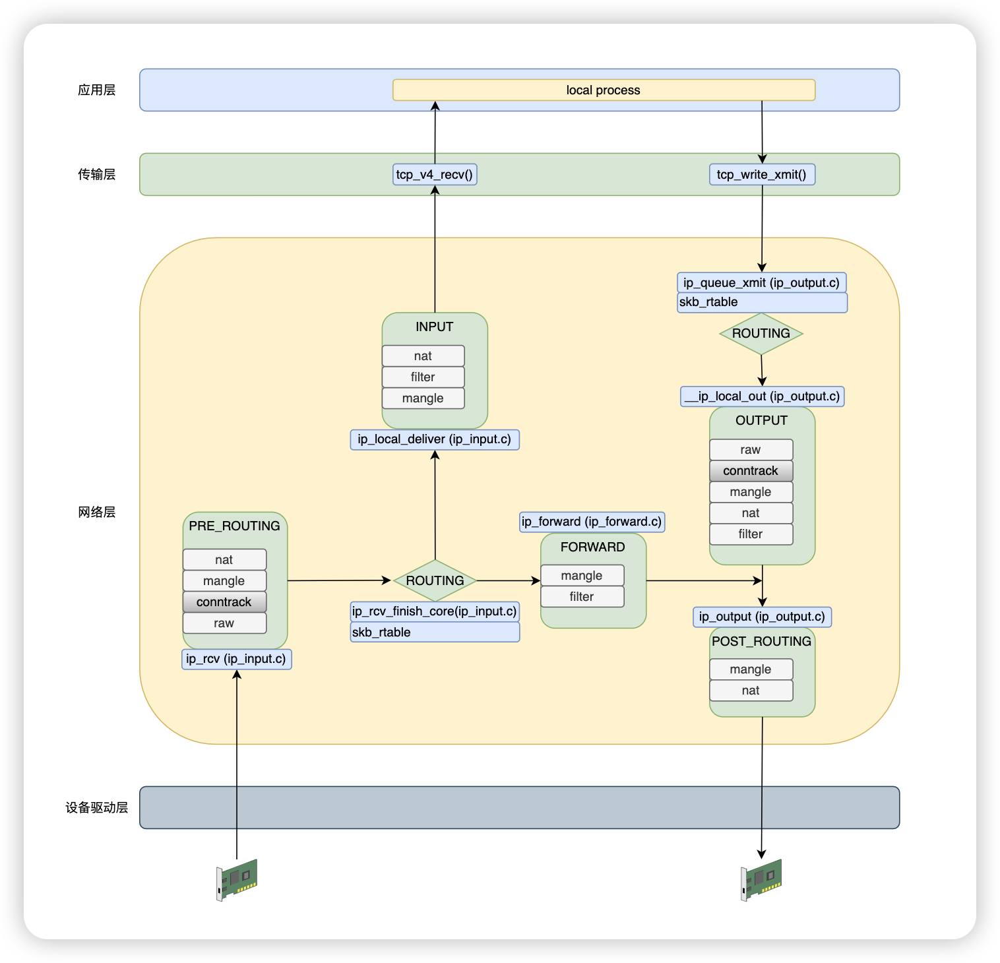

# Netfilter 简介

`Netfilter` 是由 `Linux` 内核提供的一个框架，它允许以自定义处理程序的形式实现各种与网络相关的操作。`Netfilter` 提供了用于数据包过滤、网络地址转换（NAT）和端口转换的多种功能和操作，从而实现将数据包引导通过网络以及阻止数据包到达网络中敏感位置所需的功能。

利用应用层软件，如 `iptables` 、`nftables` 、`ebtables` 和 `arptables` 等来控制 `Netfilter`。

# Netfilter 五链

## HOOK 点

- `NF_INET_PRE_ROUTING`：数据包进入网络层之后，进入路由表之前
- `NF_INET_LOCAL_IN`：通过路由表之后，且目的为本机
- `NF_INET_FORWARD`：通过路由表之后，目的地不为本机
- `NF_INET_LOCAL_OUT`：由本机产生的包，经过路由表之后
- `NF_INET_POST_ROUTING`：数据包将要离开网络层，发送到设备驱动层之前

可总结为三个方向的数据包

- 发网本地：`NF_INET_PRE_ROUTING` => `NF_INET_LOCAL_IN`
- 转发：`NF_INET_PRE_ROUTING` => `NF_INET_FORWARD` => `NF_INET_POST_ROUTING`
- 本地发出：`NF_INET_LOCAL_OUT` => `NF_INET_POST_ROUTING`

## 代码定位（ip_v4为例）

### `NF_INET_PRE_ROUTING`

```c
/*
 * file: net/ipv4/ip_input.c
 * IP receive entry point
 */
int ip_rcv(struct sk_buff *skb, struct net_device *dev, struct packet_type *pt,
	   struct net_device *orig_dev)
{
	struct net *net = dev_net(dev);

	skb = ip_rcv_core(skb, net);
	if (skb == NULL)
		return NET_RX_DROP;

	return NF_HOOK(NFPROTO_IPV4, NF_INET_PRE_ROUTING,
		       net, NULL, skb, dev, NULL,
		       ip_rcv_finish);
}
```

### `NF_INET_LOCAL_IN`

```c
/* 
 * file: net/ipv4/ip_input.c
 * 	Deliver IP Packets to the higher protocol layers.
 */
int ip_local_deliver(struct sk_buff *skb)
{
	/*
	 *	Reassemble IP fragments.
	 */
	struct net *net = dev_net(skb->dev);

	if (ip_is_fragment(ip_hdr(skb))) {
		if (ip_defrag(net, skb, IP_DEFRAG_LOCAL_DELIVER))
			return 0;
	}

	return NF_HOOK(NFPROTO_IPV4, NF_INET_LOCAL_IN,
		       net, NULL, skb, skb->dev, NULL,
		       ip_local_deliver_finish);
}
```

### `NF_INET_FORWARD`

```c
/*
 * file: net/ipv4/ip_forward.c
 */
int ip_forward(struct sk_buff *skb)
{
	u32 mtu;
	struct iphdr *iph;	/* Our header */
	struct rtable *rt;	/* Route we use */
	struct ip_options *opt	= &(IPCB(skb)->opt);
	struct net *net;
	SKB_DR(reason);

	/* that should never happen */
	if (skb->pkt_type != PACKET_HOST)
		goto drop;

	...

	return NF_HOOK(NFPROTO_IPV4, NF_INET_FORWARD,
		       net, NULL, skb, skb->dev, rt->dst.dev,
		       ip_forward_finish);
}
```

### `NF_INET_LOCAL_OUT`

```c
/*
 * file: net/ipv4/ip_output.c
 */
int __ip_local_out(struct net *net, struct sock *sk, struct sk_buff *skb)
{
	struct iphdr *iph = ip_hdr(skb);

	IP_INC_STATS(net, IPSTATS_MIB_OUTREQUESTS);

	iph_set_totlen(iph, skb->len);
	ip_send_check(iph);

	/* if egress device is enslaved to an L3 master device pass the
	 * skb to its handler for processing
	 */
	skb = l3mdev_ip_out(sk, skb);
	if (unlikely(!skb))
		return 0;

	skb->protocol = htons(ETH_P_IP);

	return nf_hook(NFPROTO_IPV4, NF_INET_LOCAL_OUT,
		       net, sk, skb, NULL, skb_dst(skb)->dev,
		       dst_output);
}
```

### `NF_INET_POST_ROUTING`

```c
/*
 * file: net/ipv4/ip_output.c
 */
int ip_output(struct net *net, struct sock *sk, struct sk_buff *skb)
{
	struct net_device *dev = skb_dst(skb)->dev, *indev = skb->dev;

	skb->dev = dev;
	skb->protocol = htons(ETH_P_IP);

	return NF_HOOK_COND(NFPROTO_IPV4, NF_INET_POST_ROUTING,
			    net, sk, skb, indev, dev,
			    ip_finish_output,
			    !(IPCB(skb)->flags & IPSKB_REROUTED));
}
```

# 图示包流转过程



# Netfilter 四表

- Filter 表：用于实现数据包过滤
  - 主要链：
    - INPUT、FORWARD、OUTPUT。
  - 作用：
    - 根据规则允许或阻止数据包。
  - 示例：
    ```bash
    # 阻止所有尝试连接到本机 TCP 22 端口（SSH 默认端口）的流量
    iptables -A INPUT -p tcp --dport 22 -j DROP 
    ```

- Nat 表：用于网络地址转换（NAT），如修改源地址或目标地址
  - 主要链：
    - PREROUTING、OUTPUT、POSTROUTING。
  - 作用：
    - DNAT（目标地址转换）。
    - SNAT（源地址转换）。
  - 示例：
    ```bash
    # 实现源地址伪装（SNAT），将从本地发出的数据包的源 IP 替换为接口 eth0 的 IP 地址
    iptables -t nat -A POSTROUTING -o eth0 -j MASQUERADE
    ```

- Mangle 表：用于对数据包进行复杂的修改

  - 主要链：
    - PREROUTING、OUTPUT、INPUT、FORWARD、POSTROUTING。
  - 作用：
    - 修改 TOS（Type of Service）、TTL（Time to Live）等数据包头部字段。
  - 示例：
    ```bash
    # 将目标端口为 80（HTTP）的数据包的 TTL 设置为 16
    iptables -t mangle -A PREROUTING -p tcp --dport 80 -j TTL --ttl-set 16
    ```

- Raw 表：用于设置数据包的连接跟踪状态。
  - 主要链：
    - PREROUTING、OUTPUT。
  - 作用：
    - 标记数据包以跳过连接跟踪（提高性能）。
  - 示例：
    ```bash
    # 禁止对目标端口为 22（SSH 服务）的所有 TCP 流量进行连接跟踪，以加速流量
    iptables -t raw -A PREROUTING -p tcp --dport 22 -j NOTRACK
    ```

# 参考资料

- https://en.wikipedia.org/wiki/Netfilter#
- https://yngty.github.io/2024/07/11/network/Netfilter-%E6%A1%86%E6%9E%B6%E6%B5%85%E6%9E%90/
- https://thermalcircle.de/doku.php?id=blog:linux:nftables_packet_flow_netfilter_hooks_detail