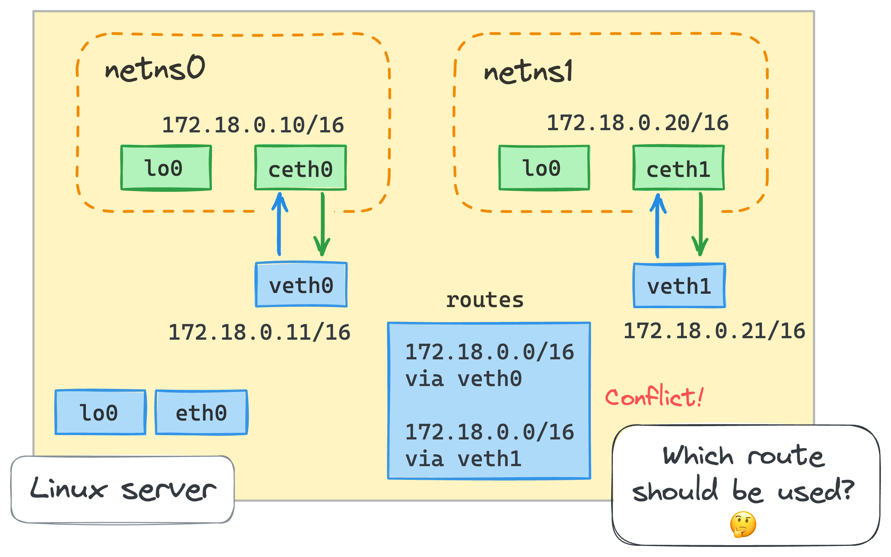
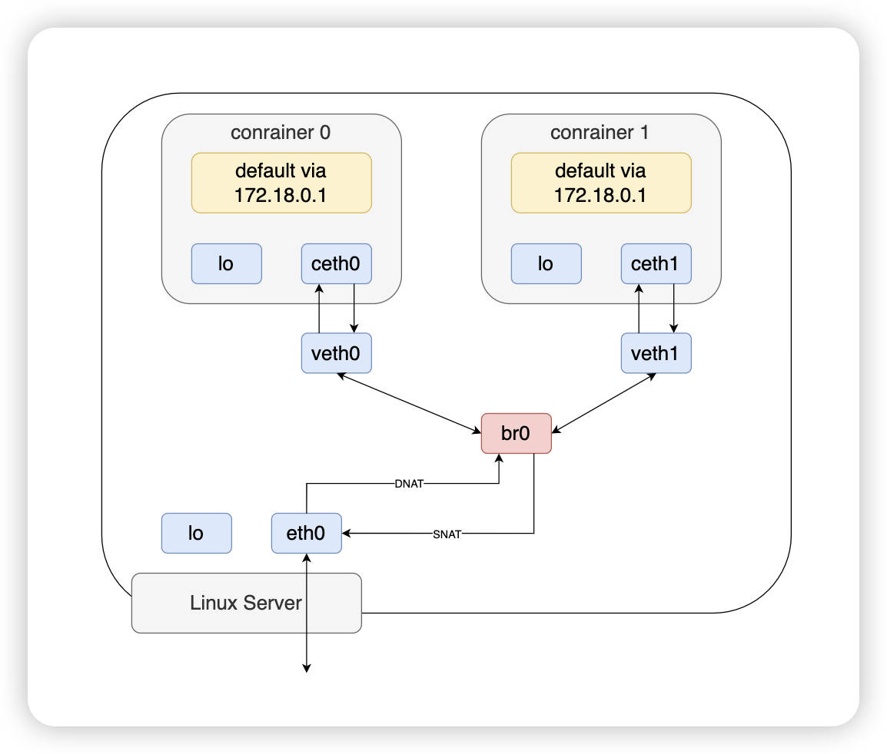

今天我们来了解容器网络是怎么工作的？

# 目标

在宿主机上动手搭建两个容器网络，并使容器之间互通。容器与宿主机之间互通，容器与外部网络之间互通。


我们知道容器是通过命令空间进行隔离网络的。那接下来我们创建网络的命名空间。

## 创建命名空间

容器 0：

```shell
ip netns add netns0
```

容器 1:

```shell
ip netns add netns1
```

现在我们查看一下网络命名空间

```shell
ip netns list
```

输出：

```shell
netns0
netns1
```

至此，网络命名空间 `netns0` 和 `netns1` 已经创建完毕。


## 配置容器到宿主机的网络

### 打通容器 0 和 宿主机的网络

创建一对网络虚拟设备（veth0，ceth0）。

```shell
ip link add veth0 type veth peer name ceth0
```

我们将 ceth0 这一端移到 netns0 下。

```shell
ip link set ceth0 netns netns0
```

启动 veth0 设备

```shell
ip link set veth0 up
```

为 veth0 分配 IP 地址

```shell
ip addr add 172.18.0.11/16 dev veth0
```

现在我们进入 netns0 下

```shell
nsenter --net=/run/netns/netns0 bash
```

查看网络

```shell
ip link list
```

输出

```shell
1: lo: <LOOPBACK> mtu 65536 qdisc noop state DOWN mode DEFAULT group default qlen 1000
    link/loopback 00:00:00:00:00:00 brd 00:00:00:00:00:00
...
5: ceth0@if6: <BROADCAST,MULTICAST> mtu 1500 qdisc noop state DOWN mode DEFAULT group default qlen 1000
    link/ether ae:1b:73:2c:77:18 brd ff:ff:ff:ff:ff:ff link-netnsid 0
```

现在将 netns0 下的 lo 和 ceth0 开启

```shell
ip link set lo up;
ip link set ceth0 up;
```

为 ceth0 分配 IP 地址

```shell
ip addr add 172.18.0.10/16 dev ceth0
```

验证容器 0 和 宿主机的网络

先从容器 0 ping 宿主机

```shell
ping -c 2 172.18.0.11
```

输出

```shell
PING 172.18.0.11 (172.18.0.11) 56(84) bytes of data.
64 bytes from 172.18.0.11: icmp_seq=1 ttl=64 time=0.038 ms
64 bytes from 172.18.0.11: icmp_seq=2 ttl=64 time=0.050 ms

--- 172.18.0.11 ping statistics ---
2 packets transmitted, 2 received, 0% packet loss, time 1011ms
rtt min/avg/max/mdev = 0.038/0.044/0.050/0.006 ms
```

退出当前命名空间到宿主机命名空间，验证宿主机到 容器 0 的网络

```shell
exit;

ping -c 2 172.18.0.10;
```

输出

```shell
PING 172.18.0.10 (172.18.0.10) 56(84) bytes of data.
64 bytes from 172.18.0.10: icmp_seq=1 ttl=64 time=0.045 ms
64 bytes from 172.18.0.10: icmp_seq=2 ttl=64 time=0.048 ms

--- 172.18.0.10 ping statistics ---
2 packets transmitted, 2 received, 0% packet loss, time 1043ms
rtt min/avg/max/mdev = 0.045/0.046/0.048/0.001 ms
```

现在容器 0 和宿主机通信正常。

### 打通容器 1 和 宿主机的网络

```shell
# 在宿主机命名空间下操作
ip link add veth1 type veth peer name ceth1;
ip link set ceth1 netns netns1;
ip link set veth1 up;
ip addr add 172.18.0.21/16 dev veth1;

# 进入到 netns1 命名空间下
nsenter --net=/run/netns/netns1 bash;
ip link set lo up;
ip link set ceth1 up;
ip addr add 172.18.0.20/16 dev ceth1;
```

验证容器 1 和 宿主机的网络

先从容器 1 ping 宿主机

```shell
ping -c 2 172.18.0.21
```

输出

```shell
PING 172.18.0.21 (172.18.0.21) 56(84) bytes of data.
From 172.18.0.20 icmp_seq=1 Destination Host Unreachable
From 172.18.0.20 icmp_seq=2 Destination Host Unreachable

--- 172.18.0.21 ping statistics ---
2 packets transmitted, 0 received, +2 errors, 100% packet loss, time 1020ms
pipe 2
```

无法从容器 1 ping 通宿主机！！！

我们再看下宿主机到 容器 1 的网络，退出当前命名空间到宿主机命名空间，

```shell
exit;

ping -c 2 172.18.0.20;
```

输出

```shell
PING 172.18.0.20 (172.18.0.20) 56(84) bytes of data.
From 172.18.0.11 icmp_seq=1 Destination Host Unreachable
From 172.18.0.11 icmp_seq=2 Destination Host Unreachable

--- 172.18.0.20 ping statistics ---
2 packets transmitted, 0 received, +2 errors, 100% packet loss, time 1045ms
pipe 2
```

现在容器 1 和宿主机通信不正常。


在宿主机上查看路由信息

```shell
ip route list
```


```shell
...
172.18.0.0/16 dev veth0 proto kernel scope link src 172.18.0.11
172.18.0.0/16 dev veth1 proto kernel scope link src 172.18.0.21
...
```

可见发生了路由的冲突。



通信不成功是数据包路由时发生了冲突。可见现在方案行不通了。

我们需要引入一个新的网络设备解决这个问题，网桥！！


# 使用网桥设备解决网络问题

在重新配置之前，我们先清空之前的配置

```shell
ip netns delete netns0;
ip netns delete netns1;


ip link delete veth0;
ip link delete ceth0;
ip link delete veth1;
ip link delete ceth1;
```


## 第 0 个容器

```shell
# 创建命名空间
ip netns add netns0;
# 创建网络虚拟设备
ip link add veth0 type veth peer name ceth0;
# 启用 veth0 设备
ip link set veth0 up;
# 将 ceth0 设备设置到 netns0 命名空间下
ip link set ceth0 netns netns0;

# 进入 netns0 命名空间
nsenter --net=/run/netns/netns0 bash;

# 启用 lo、ceth0 设备
ip link set lo up;
ip link set ceth0 up;
# 为 ceth0 设备配置 IP
ip addr add 172.18.0.10/16 dev ceth0;

# 退出到宿主机环境下
exit;
```

## 第 1 个容器

```shell
ip netns add netns1

ip link add veth1 type veth peer name ceth1
ip link set veth1 up
ip link set ceth1 netns netns1

nsenter --net=/run/netns/netns1 bash
ip link set lo up
ip link set ceth1 up
ip addr add 172.18.0.20/16 dev ceth1

exit
```

## 添加网桥设备

```shell
ip link add br0 type bridge
ip link set br0 up
```

连接 veth 设备到网桥

```shell
ip link set veth0 master br0
ip link set veth1 master br0
```


## 验证两个容器的互通性

容器 0 ping 容器 1

```shell
nsenter --net=/run/netns/netns0 ping -c 2 172.18.0.20
```

```shell
PING 172.18.0.20 (172.18.0.20) 56(84) bytes of data.
64 bytes from 172.18.0.20: icmp_seq=1 ttl=64 time=0.049 ms
64 bytes from 172.18.0.20: icmp_seq=2 ttl=64 time=0.059 ms

--- 172.18.0.20 ping statistics ---
2 packets transmitted, 2 received, 0% packet loss, time 1019ms
rtt min/avg/max/mdev = 0.049/0.054/0.059/0.005 ms
```

容器 1 ping 容器 0

```shell
nsenter --net=/run/netns/netns1 ping -c 2 172.18.0.10
```

```shell
PING 172.18.0.10 (172.18.0.10) 56(84) bytes of data.
64 bytes from 172.18.0.10: icmp_seq=1 ttl=64 time=0.034 ms
64 bytes from 172.18.0.10: icmp_seq=2 ttl=64 time=0.066 ms

--- 172.18.0.10 ping statistics ---
2 packets transmitted, 2 received, 0% packet loss, time 1047ms
rtt min/avg/max/mdev = 0.034/0.050/0.066/0.016 ms
```

容器 0 和 容器 1 互通

你是否有疑问，我们根本没有配置 veth0 和 veth1 的 IP，怎么就能通信了呢？

那是因为，网桥属于二层设备。不需要依赖 IP 通信。

查看邻居：

```shell
nsenter --net=/run/netns/netns0 ip neigh
```

```shell
172.18.0.20 dev ceth0 lladdr c6:da:fc:82:66:b9 STALE
```

```shell
nsenter --net=/run/netns/netns1 ip neigh
```

```shell
172.18.0.10 dev ceth1 lladdr ee:7a:7b:79:32:ff STALE
```


## 打通容器到宿主机网络

为网桥设备配置 IP

```shell
ip addr add 172.18.0.1/16 dev br0
```


为 容器 0 配置默认路由

```shell
nsenter --net=/run/netns/netns0 \
  ip route add default via 172.18.0.1  # i.e. via the bridge interface
```


为 容器 1 配置默认路由

```shell
nsenter --net=/run/netns/netns1 \
  ip route add default via 172.18.0.1  # i.e. via the bridge interface
```


查看宿主机 eth0 网卡地址

```shell
ip addr | grep eth0
```

```shell
4: eth0@if17: <BROADCAST,MULTICAST,UP,LOWER_UP> mtu 1500 qdisc noqueue state UP group default qlen 1000
    inet 198.19.249.234/24 brd 198.19.249.255 scope global dynamic noprefixroute eth0
10: veth0@if9: <BROADCAST,MULTICAST,UP,LOWER_UP> mtu 1500 qdisc noqueue master br0 state UP group default qlen 1000
```


验证从容器到宿主机的网络

```shell
nsenter --net=/run/netns/netns0 ping -c 2 198.19.249.234
```

输出：

```shell
PING 198.19.249.234 (198.19.249.234) 56(84) bytes of data.
64 bytes from 198.19.249.234: icmp_seq=1 ttl=64 time=0.035 ms
64 bytes from 198.19.249.234: icmp_seq=2 ttl=64 time=0.047 ms

--- 198.19.249.234 ping statistics ---
2 packets transmitted, 2 received, 0% packet loss, time 1055ms
rtt min/avg/max/mdev = 0.035/0.041/0.047/0.006 ms
```

目前为止，容器与容器之间，容器与宿主机之间都可以正常通信了。


## 打通容器到外部网络

开启 IP 转发，把宿主机当成时一个路由器

```shell
echo 1 > /proc/sys/net/ipv4/ip_forward
```

增加一条 NAT 规则

```shell
iptables -t nat -A POSTROUTING -s 172.18.0.0/16 ! -o br0 -j MASQUERADE
```

对于源地址属于 `172.18.0.0/16` 网段的数据包，且数据包的出口接口不是 `br0`，在离开宿主机时，将源地址修改为出口接口的 IP 地址（伪装地址）。

这是因为我们的容器内配置的是私有地址，网络包回来的时候，没办法路由到私有地址。所以需要进行 SNAT。

验证一下：

```shell
nsenter --net=/run/netns/netns0 ping -c 2 8.8.8.8
```

输出

```shell
PING 8.8.8.8 (8.8.8.8) 56(84) bytes of data.
64 bytes from 8.8.8.8: icmp_seq=1 ttl=62 time=0.549 ms
64 bytes from 8.8.8.8: icmp_seq=2 ttl=62 time=0.842 ms

--- 8.8.8.8 ping statistics ---
2 packets transmitted, 2 received, 0% packet loss, time 1012ms
rtt min/avg/max/mdev = 0.549/0.695/0.842/0.146 ms
```

容器到外部网络通信正常！！


## 从外部网络访问容器

使用 python 启动一个服务，监听 IP 为 172.18.0.10  的 5000 端口。

```shell
nsenter --net=/run/netns/netns0 python3 -m http.server --bind 172.18.0.10 5000
```


添加一条 DNAT 规则

```shell
iptables -t nat -A PREROUTING \
  -d 198.19.249.234 -p tcp -m tcp --dport 5000 \
  -j DNAT --to-destination 172.18.0.10:5000
```

访问 ip 为 198.19.249.234 端口为 5000 的 tcp 流量会发送到 172.18.0.10:5000，也就是我们的服务监听的地址。


验证一下：

```shell
curl 198.19.249.234:5000
```

输出

```html
<!DOCTYPE HTML PUBLIC "-//W3C//DTD HTML 4.01//EN" "http://www.w3.org/TR/html4/strict.dtd">
<html>
<head>
<meta http-equiv="Content-Type" content="text/html; charset=utf-8">
<title>Directory listing for /</title>
</head>
<body>
<h1>Directory listing for /</h1>
<hr>
<ul>
<li><a href=".bash_history">.bash_history</a></li>
<li><a href=".bash_logout">.bash_logout</a></li>
<li><a href=".bash_profile">.bash_profile</a></li>
<li><a href=".bashrc">.bashrc</a></li>
<li><a href=".cshrc">.cshrc</a></li>
<li><a href=".ssh/">.ssh/</a></li>
<li><a href=".tcshrc">.tcshrc</a></li>
</ul>
<hr>
</body>
</html>
```

访问正常！！

通信路径如下：



# 参考资料

- https://labs.iximiuz.com/tutorials/container-networking-from-scratch
- https://labs.iximiuz.com/courses/computer-networking-fundamentals/bridge-vs-switch
- https://blog.scottlowe.org/2013/09/04/introducing-linux-network-namespaces/