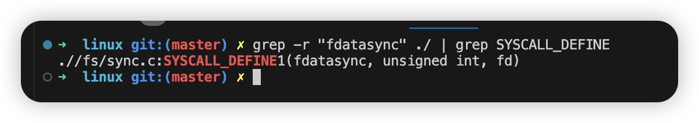

# Redis 持久化方式

## RDB

- `save <seconds> <changes> [<seconds> <changes> ...]`  eg: `save 3600 1 300 100 60 10000`

## AOF

- `appendfsync always`
- `appendfsync everysec`
- `appendfsync no`

小结：`RDB` 模式下满足设定条件的情况下打快照显然不能保证，同理，`AOF`  模式下 `appendfsync everysec` 也是不能满足。

那 `AOF` 模式下 `appendfsync always` 能保证吗？

# 分析 appendfsync always

## 进入 Redis 源代码分析

### main 函数入口

```c
int main(int argc, char **argv) {
    struct timeval tv;
    int j;
    char config_from_stdin = 0;

    initServer();
    
    aeMain(server.el);
  
    return 0;
}
```

先调用 `initServer`，后调用 `aeMain`。

首先关注 `initServer`

```c
void initServer(void) {
  	...
    aeSetBeforeSleepProc(server.el,beforeSleep);
  	...
}
```

设置了 `beforeSleep`, 具体怎么用，做了什么操作我们后面再看。

接下来看 `aeMain`

```c
void aeMain(aeEventLoop *eventLoop) {
    eventLoop->stop = 0;
    while (!eventLoop->stop) {
        aeProcessEvents(eventLoop, AE_ALL_EVENTS|
                                   AE_CALL_BEFORE_SLEEP|
                                   AE_CALL_AFTER_SLEEP);
    }
}
```

可以看到 `aeMain` 是一个事件循环处理器，我门进入 `aeProcessEvents`

#### aeProcessEvents 分析

```c
int aeProcessEvents(aeEventLoop *eventLoop, int flags)
{
    int processed = 0, numevents;

        eventLoop->beforesleep(eventLoop);

        /* Call the multiplexing API, will return only on timeout or when
         * some event fires. */
        numevents = aeApiPoll(eventLoop, tvp);

        for (j = 0; j < numevents; j++) {
            int fd = eventLoop->fired[j].fd;
            aeFileEvent *fe = &eventLoop->events[fd];
            int mask = eventLoop->fired[j].mask;
            int fired = 0; /* Number of events fired for current fd. */

            /* Normally we execute the readable event first, and the writable
             * event later. This is useful as sometimes we may be able
             * to serve the reply of a query immediately after processing the
             * query.
             *
             * However if AE_BARRIER is set in the mask, our application is
             * asking us to do the reverse: never fire the writable event
             * after the readable. In such a case, we invert the calls.
             * This is useful when, for instance, we want to do things
             * in the beforeSleep() hook, like fsyncing a file to disk,
             * before replying to a client. */
            int invert = fe->mask & AE_BARRIER;

            /* Note the "fe->mask & mask & ..." code: maybe an already
             * processed event removed an element that fired and we still
             * didn't processed, so we check if the event is still valid.
             *
             * Fire the readable event if the call sequence is not
             * inverted. */
            if (!invert && fe->mask & mask & AE_READABLE) {
                fe->rfileProc(eventLoop,fd,fe->clientData,mask);
                fired++;
                fe = &eventLoop->events[fd]; /* Refresh in case of resize. */
            }

            /* Fire the writable event. */
            if (fe->mask & mask & AE_WRITABLE) {
                if (!fired || fe->wfileProc != fe->rfileProc) {
                    fe->wfileProc(eventLoop,fd,fe->clientData,mask);
                    fired++;
                }
            }

            /* If we have to invert the call, fire the readable event now
             * after the writable one. */
            if (invert) {
                fe = &eventLoop->events[fd]; /* Refresh in case of resize. */
                if ((fe->mask & mask & AE_READABLE) &&
                    (!fired || fe->wfileProc != fe->rfileProc))
                {
                    fe->rfileProc(eventLoop,fd,fe->clientData,mask);
                    fired++;
                }
            }

            processed++;
        }
    }

    return processed; /* return the number of processed file/time events */
}

```

`aeProcessEvents` 主要做三件事:

1. 调用 `beforesleep` 。
2. 通过 `aeApiPoll` 获取就绪的 `socket` 。
3. 按照 `socket` 事件类型处理数据。

##### beforesleep 分析

接下来分析 `beforesleep` 做了什么操作。

```c
void beforeSleep(struct aeEventLoop *eventLoop) {
    ...
    if (server.aof_state == AOF_ON || server.aof_state == AOF_WAIT_REWRITE)
        flushAppendOnlyFile(0);
    ...
}
```

执行了 `flushAppendOnlyFile` 操作，即写 `AOF` 文件。

```c
void flushAppendOnlyFile(int force) {
    ssize_t nwritten;
    int sync_in_progress = 0;
    mstime_t latency;

    if (server.aof_fsync == AOF_FSYNC_EVERYSEC &&
        server.aof_last_incr_fsync_offset != server.aof_last_incr_size &&
        server.mstime - server.aof_last_fsync >= 1000 &&
        !(sync_in_progress = aofFsyncInProgress())) {
        goto try_fsync;
      
try_fsync:
    if (redis_fsync(server.aof_fd) == -1) {
        serverLog(LL_WARNING,"Can't persist AOF for fsync error when the "
          "AOF fsync policy is 'always': %s. Exiting...", strerror(errno));
        exit(1);
    }
}
```

接着看 `redis_fsync`

```c
#define redis_fsync(fd) fdatasync(fd)
```

发起一个系统调用 `fdatasync`

进入 linux 源码

```shell
grep -r "fdatasync" ./ | grep SYSCALL_DEFINE
```



```c
SYSCALL_DEFINE1(fdatasync, unsigned int, fd)
{
	return do_fsync(fd, 1);
}
```

```c
static int do_fsync(unsigned int fd, int datasync)
{
	CLASS(fd, f)(fd);

	if (fd_empty(f))
		return -EBADF;

	return vfs_fsync(fd_file(f), datasync);
}
```

最终向文件系统发起 `vfs_fsync` 写盘！至此，`beforeSleep` 分析完毕。接下来分析 `aeApiPoll`

##### aeApiPoll 分析

```c
static int aeApiPoll(aeEventLoop *eventLoop, struct timeval *tvp) {
    aeApiState *state = eventLoop->apidata;
    int retval, numevents = 0;

    retval = epoll_wait(state->epfd,state->events,eventLoop->setsize,
            tvp ? (tvp->tv_sec*1000 + (tvp->tv_usec + 999)/1000) : -1);
    if (retval > 0) {
        int j;

        numevents = retval;
        for (j = 0; j < numevents; j++) {
            int mask = 0;
            struct epoll_event *e = state->events+j;

            if (e->events & EPOLLIN) mask |= AE_READABLE;
            if (e->events & EPOLLOUT) mask |= AE_WRITABLE;
            if (e->events & EPOLLERR) mask |= AE_WRITABLE|AE_READABLE;
            if (e->events & EPOLLHUP) mask |= AE_WRITABLE|AE_READABLE;
            eventLoop->fired[j].fd = e->data.fd;
            eventLoop->fired[j].mask = mask;
        }
    } else if (retval == -1 && errno != EINTR) {
        panic("aeApiPoll: epoll_wait, %s", strerror(errno));
    }

    return numevents;
}
```

通过 `epoll_wait` 获取就绪事件的 `socket` 集合。


#### aeProcessEvents 总结

1. 先做持久化
2. 通过 `epoll_wait` 获取就绪事件的 `socket` 集合。
3.  for 循环遍历处理 redis 的收到的命令。

那问题来了：持久化操作的还是上一次事件循环的请求。本次事件循环处理的命令还没来得及做持久化。

# 结论

<font color=red>Redis 不可以做到百分百数据不丢失。</font>

