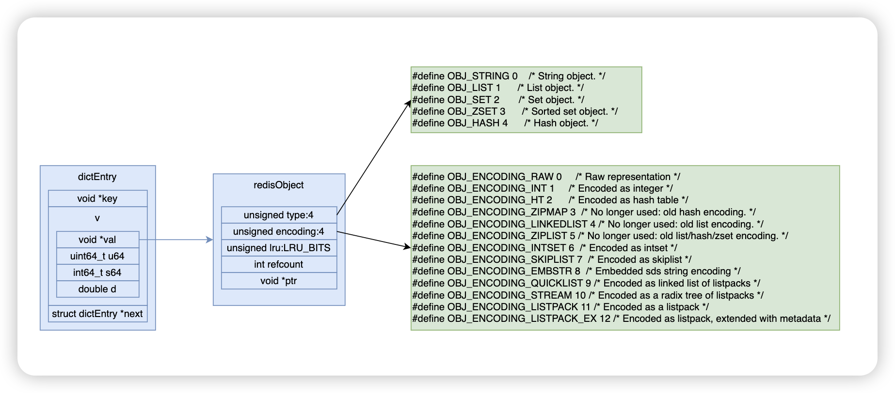
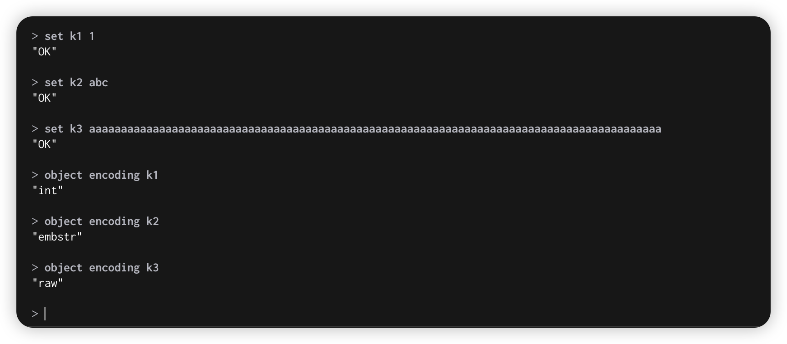
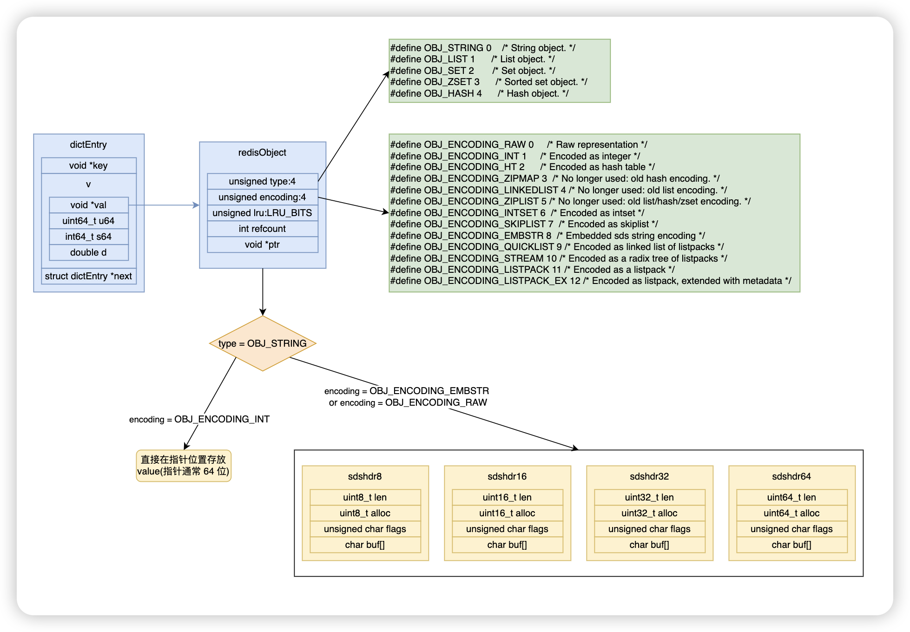
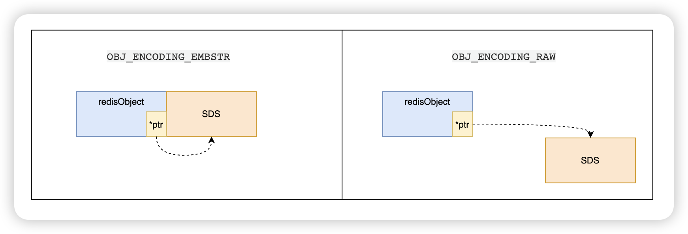
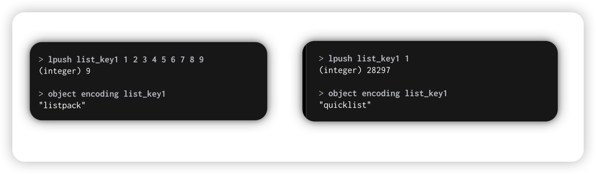
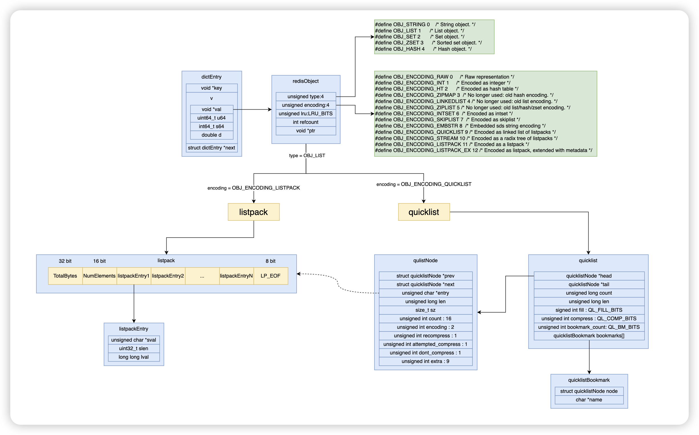
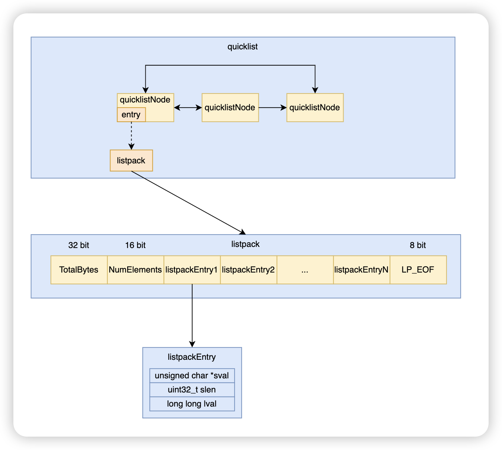

# 内置结构

`dictEntry` 结构

```c
struct dictEntry {
    void *key;
    union {
        void *val;	// 存储复杂数据结构
        uint64_t u64;	// 存储无符号整数类型
        int64_t s64;	// 存储有符号整数类型
        double d;	//存储浮点数类型
    } v;
    struct dictEntry *next;     /* Next entry in the same hash bucket. */
};
```


`redisObject` 结构

```c
struct redisObject {
    unsigned type:4;
    unsigned encoding:4;
    unsigned lru:LRU_BITS; /* LRU time (relative to global lru_clock) or
                            * LFU data (least significant 8 bits frequency
                            * and most significant 16 bits access time). */
    int refcount;
    void *ptr;
};
```




# String

先使用 `object encoding key` 命令查看编码。





## 从 setCommand 开始

```c
// src/t_string.c
void setCommand(client *c) {
    robj *expire = NULL;
    int unit = UNIT_SECONDS;
    int flags = OBJ_NO_FLAGS;

    if (parseExtendedStringArgumentsOrReply(c,&flags,&unit,&expire,COMMAND_SET) != C_OK) {
        return;
    }

    c->argv[2] = tryObjectEncoding(c->argv[2]);
    setGenericCommand(c,flags,c->argv[1],c->argv[2],expire,unit,NULL,NULL);
}
```

重点关注 `tryObjectEncoding`

```c
// src/object.c
robj *tryObjectEncoding(robj *o) {
    return tryObjectEncodingEx(o, 1);
}
```

## 编码过程

```c
// src/object.c
robj *tryObjectEncodingEx(robj *o, int try_trim) {
    long value;
    sds s = o->ptr;
    size_t len;

    len = sdslen(s);
    if (len <= 20 && string2l(s,len,&value)) {
        /* This object is encodable as a long. Try to use a shared object.
         * Note that we avoid using shared integers when maxmemory is used
         * because every object needs to have a private LRU field for the LRU
         * algorithm to work well. */
        if ((server.maxmemory == 0 ||
            !(server.maxmemory_policy & MAXMEMORY_FLAG_NO_SHARED_INTEGERS)) &&
            value >= 0 &&
            // #define OBJ_SHARED_INTEGERS 10000
            value < OBJ_SHARED_INTEGERS)
        {
            decrRefCount(o);
            return shared.integers[value];
        } else {
            if (o->encoding == OBJ_ENCODING_RAW) {
                sdsfree(o->ptr);
                o->encoding = OBJ_ENCODING_INT;
                o->ptr = (void*) value;
                return o;
            } else if (o->encoding == OBJ_ENCODING_EMBSTR) {
                decrRefCount(o);
                return createStringObjectFromLongLongForValue(value);
            }
        }
    }

    
  	// #define OBJ_ENCODING_EMBSTR_SIZE_LIMIT 44
    if (len <= OBJ_ENCODING_EMBSTR_SIZE_LIMIT) {
        robj *emb;

        if (o->encoding == OBJ_ENCODING_EMBSTR) return o;
        emb = createEmbeddedStringObject(s,sdslen(s));
        decrRefCount(o);
        return emb;
    }

    /* We can't encode the object...
     * Do the last try, and at least optimize the SDS string inside */
    if (try_trim)
        trimStringObjectIfNeeded(o, 0);

    /* Return the original object. */
    return o;
}
```

> 以上过程总结：
>
> 1. 先尝试用 `OBJ_ENCODING_INT` 编码，value 直接写在指针位置上。
> 2. 如果字符长度小于 44 ，尝试用 `OBJ_ENCODING_EMBSTR` 编码，value 使用 sds 结构。
> 3. 最后使用 `OBJ_ENCODING_RAW` 编码，value 使用 sds 结构。

那 `OBJ_ENCODING_EMBSTR` 和 `OBJ_ENCODING_RAW` 有什么区别呢？

从内存分配上对比一下



> 可见：
>
> 1. OBJ_ENCODING_EMBSTR 编码时，SDS 使用与 redisObject 连续的空间，以提升读写效率。
> 2. OBJ_ENCODING_RAW 编码时，SDS 使用与  redisObject 不连续的空间，以提升内存使用率。

## String 总结

1. String 使用三种编码方式，分别为 `OBJ_ENCODING_INT`，`OBJ_ENCODING_EMBSTR`， `OBJ_ENCODING_RAW`。
2. 优先尝试用 `OBJ_ENCODING_INT`，如果尝试成功，则直接将指写在 `redisObject` 对象的 `value` 指针位置。
3. 当字符串小于 44 时，尝试使用 `OBJ_ENCODING_EMBSTR` 编码，使用 `SDS` 表示字符串对象，`redisObject` 采用一次内存分配，即 `SDS` 和 `redisObject` 使用相邻的内存空间，以提升读写效率。
4. 当字符串大于 44 时，使用 `OBJ_ENCODING_RAW` 编码，使用 `SDS` 表示字符串对象，`redisObject` 采用两次内存分配，即 `SDS` 和 `redisObject` 使用不同的内存空间，以提升内存利用率。

# List

先使用 `object encoding key` 命令查看编码。









## 从 lpushCommand 开始

```c
void lpushCommand(client *c) {
    pushGenericCommand(c,LIST_HEAD,0);
}
```

```c
void pushGenericCommand(client *c, int where, int xx) {
    unsigned long llen;
    int j;

    robj *lobj = lookupKeyWrite(c->db, c->argv[1]);
    if (checkType(c,lobj,OBJ_LIST)) return;
    if (!lobj) {
        if (xx) {
            addReply(c, shared.czero);
            return;
        }

        lobj = createListListpackObject();
        dbAdd(c->db,c->argv[1],lobj);
    }

    listTypeTryConversionAppend(lobj,c->argv,2,c->argc-1,NULL,NULL);
    for (j = 2; j < c->argc; j++) {
        listTypePush(lobj,c->argv[j],where);
        server.dirty++;
    }
		...
}
```

> 重点做三件件事
>
> 1. 如果不存在 key 则创建一个 listpack
> 2. 尝试进行 listpack 与 quicklist 的转换
> 3. 将元素插入列表


重点关注`listTypeTryConversionAppend`

## 编码分析

```c
void listTypeTryConversionAppend(robj *o, robj **argv, int start, int end,
                                 beforeConvertCB fn, void *data)
{
    listTypeTryConversionRaw(o, LIST_CONV_GROWING, argv, start, end, fn, data);
}
```

```c
static void listTypeTryConversionRaw(robj *o, list_conv_type lct,
                                     robj **argv, int start, int end,
                                     beforeConvertCB fn, void *data)
{
    if (o->encoding == OBJ_ENCODING_QUICKLIST) {
        if (lct == LIST_CONV_GROWING) return; /* Growing has nothing to do with quicklist */
        listTypeTryConvertQuicklist(o, lct == LIST_CONV_SHRINKING, fn, data);
    } else if (o->encoding == OBJ_ENCODING_LISTPACK) {
        if (lct == LIST_CONV_SHRINKING) return; /* Shrinking has nothing to do with listpack */
        listTypeTryConvertListpack(o, argv, start, end, fn, data);
    } else {
        serverPanic("Unknown list encoding");
		}
}
```

接下来看关键方法 `listTypeTryConvertQuicklist` 和 `listTypeTryConvertListpack`

```c
static void listTypeTryConvertQuicklist(robj *o, int shrinking, beforeConvertCB fn, void *data) {
    serverAssert(o->encoding == OBJ_ENCODING_QUICKLIST);

    size_t sz_limit;
    unsigned int count_limit;
    quicklist *ql = o->ptr;

    /* A quicklist can be converted to listpack only if it has only one packed node. */
    if (ql->len != 1 || ql->head->container != QUICKLIST_NODE_CONTAINER_PACKED)
        return;

    /* Check the length or size of the quicklist is below the limit. */
    quicklistNodeLimit(server.list_max_listpack_size, &sz_limit, &count_limit);
    ...
    o->encoding = OBJ_ENCODING_LISTPACK;
}
```

> 这段代码尝试将 `quicklist` 转换为更紧凑的 `listpack`
>
> 转换条件：
>
> 1. `quicklist` 必须只有一个节点
> 2. 节点必须是“打包”形式（存储为 `listpack`）
> 3. 节点的大小和元素数量必须在限制范围内

```c
static void listTypeTryConvertListpack(robj *o, robj **argv, int start, int end,
                                       beforeConvertCB fn, void *data)
{
    serverAssert(o->encoding == OBJ_ENCODING_LISTPACK);

    size_t add_bytes = 0;
    size_t add_length = 0;


    if (quicklistNodeExceedsLimit(server.list_max_listpack_size,
            lpBytes(o->ptr) + add_bytes, lpLength(o->ptr) + add_length))
    {
        /* Invoke callback before conversion. */
        if (fn) fn(data);
				...
        quicklist *ql = quicklistNew(server.list_max_listpack_size, server.list_compress_depth);
				...
        o->encoding = OBJ_ENCODING_QUICKLIST;
    }
}
```

> 这段代码尝试将 `listpack` 转换为 `quicklist`
>
> 节点的大小和元素数量超过 `listpack` 范围时触发

## List 总结

1. `List` 底层采用 `listpack` 和 `quicklist` 两种数据结构
2. 当数据量小的时候，采用更节奏的 `listpack`
3. 随着元素数量和大小的不断变化，`listpack` 和 `quicklist` 可相互转换


# Hash

先使用 `object encoding key` 命令查看编码。


## 从 hsetcommand 开始

```c
void hsetCommand(client *c) {
    int i, created = 0;
    robj *o;
		...
    if ((o = hashTypeLookupWriteOrCreate(c,c->argv[1])) == NULL) return;
    hashTypeTryConversion(c->db,o,c->argv,2,c->argc-1);

    for (i = 2; i < c->argc; i += 2)
        created += !hashTypeSet(c->db, o,c->argv[i]->ptr,c->argv[i+1]->ptr,HASH_SET_COPY);

    ...
}
```

> 1. 先查找 key，找不到则创建
> 2. 然后尝试类型转换（listpack -> hashtable）
> 3. 添加元素

重点关注 `hashTypeTryConversion`

## 编码码分析

```c
void hashTypeTryConversion(redisDb *db, robj *o, robj **argv, int start, int end) {
    int i;
    size_t sum = 0;

    if (o->encoding != OBJ_ENCODING_LISTPACK && o->encoding != OBJ_ENCODING_LISTPACK_EX)
        return;

    /* We guess that most of the values in the input are unique, so
     * if there are enough arguments we create a pre-sized hash, which
     * might over allocate memory if there are duplicates. */
    size_t new_fields = (end - start + 1) / 2;
    if (new_fields > server.hash_max_listpack_entries) {
        hashTypeConvert(o, OBJ_ENCODING_HT, &db->hexpires);
        dictExpand(o->ptr, new_fields);
        return;
    }

    for (i = start; i <= end; i++) {
        if (!sdsEncodedObject(argv[i]))
            continue;
        size_t len = sdslen(argv[i]->ptr);
        if (len > server.hash_max_listpack_value) {
            hashTypeConvert(o, OBJ_ENCODING_HT, &db->hexpires);
            return;
        }
        sum += len;
    }
    if (!lpSafeToAdd(hashTypeListpackGetLp(o), sum))
        hashTypeConvert(o, OBJ_ENCODING_HT, &db->hexpires);
}
```

> `listpack` 转为 `hashtable` 的条件
>
> 1. 字段数超过 `server.hash_max_listpack_entries`
> 2. 字段的长度超过 `server.hash_max_listpack_value`
> 3. 总长度超过 `listpack` 的安全限制

## Hash 总结

1. `Hash` 底层采用 `listpack` 和 `hashtable` 两种数据结构
2. 当元素数量少的时候，使用紧凑的 `listpack` 结构
3. 当字段数量或者大小达到一定大小时，转换为 `hashtable`

# Set

先使用 `object encoding key` 命令查看编码。


## 从 saddCommand 开始

```c
void saddCommand(client *c) {
    robj *set;
    int j, added = 0;

    set = lookupKeyWrite(c->db,c->argv[1]);
    if (checkType(c,set,OBJ_SET)) return;
    
    if (set == NULL) {
        set = setTypeCreate(c->argv[2]->ptr, c->argc - 2);
        dbAdd(c->db,c->argv[1],set);
    } else {
        setTypeMaybeConvert(set, c->argc - 2);
    }

    for (j = 2; j < c->argc; j++) {
        if (setTypeAdd(set,c->argv[j]->ptr)) added++;
    }
    if (added) {
        unsigned long size = setTypeSize(set);
        updateKeysizesHist(c->db, getKeySlot(c->argv[1]->ptr), OBJ_SET, size - added, size);
        signalModifiedKey(c,c->db,c->argv[1]);
        notifyKeyspaceEvent(NOTIFY_SET,"sadd",c->argv[1],c->db->id);
    }
    server.dirty += added;
    addReplyLongLong(c,added);
}
```

> 1、先查找 key，找不到则创建，`setTypeCreate`
>
> 2、尝试转换存储结构，`setTypeMaybeConvert`
>
> 3、添加元素

重点关注 `setTypeCreate` 

## 编码分析过程

```c
robj *setTypeCreate(sds value, size_t size_hint) {
    if (isSdsRepresentableAsLongLong(value,NULL) == C_OK && size_hint <= server.set_max_intset_entries)
        return createIntsetObject();
    if (size_hint <= server.set_max_listpack_entries)
        return createSetListpackObject();

    /* We may oversize the set by using the hint if the hint is not accurate,
     * but we will assume this is acceptable to maximize performance. */
    robj *o = createSetObject();
    dictExpand(o->ptr, size_hint);
    return o;
}
```

> 1. 先尝试创建 `Intset` ，满足元素可以可以转换为数值类型，且数量小于 `server.set_max_intset_entries`
> 2. 不满足 `Intset` 条件则尝试创建 `listpack`，数量小于 `server.set_max_intset_entries`
> 3. 均不满足则使用 `hashtable`

## Set 总结

1. `Set` 底层采用 `Intset`，`listpack`，`hashtable`  三种数据结构。
2. 如果元素数量较少，且都是数值类型的，则使用 `Intset`
3. 如果元素数量较少，且饱含非数值类型的，则使用 `listpack`
4. 如果不满足使用  `Intset`，`listpack` 条件，则使用`hashtable` 结构


# Sorted set

先使用 `object encoding key` 命令查看编码。


跳表结构


## 从 zaddCommand 开始

```c
void zaddCommand(client *c) {
    zaddGenericCommand(c,ZADD_IN_NONE);
}
```

```c
void zaddGenericCommand(client *c, int flags) {
    static char *nanerr = "resulting score is not a number (NaN)";
    ...
    /* Lookup the key and create the sorted set if does not exist. */
    zobj = lookupKeyWrite(c->db,key);
    if (checkType(c,zobj,OBJ_ZSET)) goto cleanup;
    if (zobj == NULL) {
        if (xx) goto reply_to_client; /* No key + XX option: nothing to do. */
        zobj = zsetTypeCreate(elements, sdslen(c->argv[scoreidx+1]->ptr));
        dbAdd(c->db,key,zobj);
    } else {
        zsetTypeMaybeConvert(zobj, elements);
    }
		...
}
```

> 1、先查找 key，找不到则创建，`zsetTypeCreate`
>
> 2、尝试转换存储结构，`zsetTypeMaybeConvert`
>
> 3、添加元素

重点观察 `zsetTypeCreate`

## 编码分析过程

```c
robj *zsetTypeCreate(size_t size_hint, size_t val_len_hint) {
    if (size_hint <= server.zset_max_listpack_entries &&
        val_len_hint <= server.zset_max_listpack_value)
    {
        return createZsetListpackObject();
    }

    robj *zobj = createZsetObject();
    zset *zs = zobj->ptr;
    dictExpand(zs->dict, size_hint);
    return zobj;
}
```

> 如果数量小于 `server.zset_max_listpack_entries` 且大小小于 `server.zset_max_listpack_value` 时，使用 `listpack`
>
> 否则使用 `skiplist`

# 总结

| 数据类型   | 使用的数据结构（编码方式）  |
| ---------- | --------------------------- |
| String     | OBJ_ENCODING_INT、SDS       |
| List       | LISTPACK、QUICKLIST         |
| Hash       | LISTPACK、HASHTABLE         |
| Set        | INTSET、LISTPACK、HASHTABLE |
| Sorted set | LISTPACK、SKIPLIST          |


# 参考资料

- https://redis.io/docs/latest/develop/data-types/
- https://redis.io/docs/latest/commands/object-encoding/
- https://juejin.cn/post/7298160530291998732
- https://juejin.cn/post/7220950867339247653


